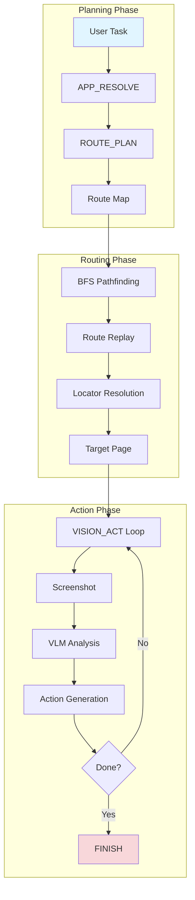
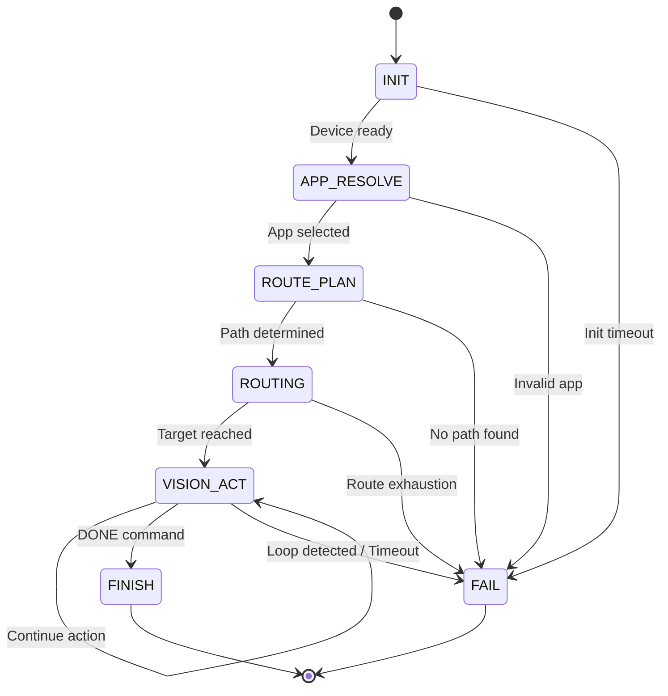

# LXB-Cortex: Route-Then-Act Automation Engine

## 1. Scope and Abstract

LXB-Cortex implements the **Route-Then-Act** paradigm for Android automation, combining deterministic graph-based navigation with Vision-Language Model (VLM) guided task execution. The system uses a Finite State Machine (FSM) to manage automation lifecycle, separating navigation concerns from action execution.

**Academic Contribution**: LXB-Cortex introduces a **hybrid automation paradigm** that achieves the reliability of deterministic routing through pre-built navigation maps while maintaining the flexibility of VLM-guided execution for complex, dynamic tasks. This approach reduces VLM API calls by 60-80% compared to pure vision-based approaches while maintaining cross-device compatibility.

## 2. Architecture Overview

### 2.1 Code Organization

```
src/cortex/
├── __init__.py
├── fsm_runtime.py          # FSM state machine engine with coordinate probing
├── route_then_act.py       # BFS pathfinding and route execution
└── fsm_instruction.py      # DSL instruction parser and validator
```

### 2.2 System Architecture



### 2.3 Three-Phase Execution Model

```
┌─────────────────────────────────────────────────────────────┐
│ Phase 1: Planning (Deterministic LLM Analysis)               │
│                                                              │
│  APP_RESOLVE → Select target application from candidates    │
│  ROUTE_PLAN  → Plan target page from navigation map         │
├─────────────────────────────────────────────────────────────┤
│ Phase 2: Routing (Graph-Based Navigation)                   │
│                                                              │
│  BFS Pathfinding → Find shortest path in navigation graph  │
│  Route Replay → Execute path via XML locators               │
│  Popup Recovery → Handle known and VLM-detected popups     │
├─────────────────────────────────────────────────────────────┤
│ Phase 3: Action (VLM-Guided Execution)                      │
│                                                              │
│  VISION_ACT Loop → Screenshot → VLM → Action → Repeat       │
│  Loop Detection → Prevent infinite action repetition        │
│  DONE → Task completion                                      │
└─────────────────────────────────────────────────────────────┘
```

## 3. Finite State Machine Formalization

### 3.1 Quintuple Definition

Define the automation FSM as a 5-tuple:

$$
M = (S, \Sigma, \delta, s_0, F)
$$

Where:
- **State Set** $S = \{s_{init}, s_{app\_resolve}, s_{route\_plan}, s_{routing}, s_{vision\_act}, s_{finish}, s_{fail}\}$
- **Input Alphabet** $\Sigma = \{\text{CMD}, \text{RESPONSE}, \text{TIMEOUT}, \text{ERROR}, \text{DONE}, \text{FAIL}\}$
- **Transition Function** $\delta: S \times \Sigma \to S$
- **Initial State** $s_0 = s_{init}$
- **Accepting States** $F = \{s_{finish}\}$

### 3.2 State Transition Diagram



### 3.3 State Transition Table

| Current State | Input Event | Next State | Action |
|---------------|-------------|------------|--------|
| INIT | Device ready | APP_RESOLVE | Probe coordinate space |
| INIT | Timeout × N | FAIL | Initialization failed |
| APP_RESOLVE | SET_APP cmd | ROUTE_PLAN | Store selected package |
| ROUTE_PLAN | ROUTE cmd | ROUTING | Start BFS pathfinding |
| ROUTING | Path success | VISION_ACT | Enter action phase |
| ROUTING | Path failure × N | FAIL | Routing exhausted |
| VISION_ACT | DONE | FINISH | Task complete |
| VISION_ACT | Loop detected | FAIL | Prevent infinite loop |
| VISION_ACT | Timeout × N | FAIL | Execution timeout |
| VISION_ACT | Other valid cmd | VISION_ACT | Continue execution |

## 4. BFS Path Planning

### 4.1 Graph Model Definition

Define the navigation graph as a directed graph:

$$
G = (V, E)
$$

Where:
- **Vertex Set** $V$: All pages in the app (page_id)
- **Edge Set** $E \subseteq V \times V$: Transition relationships between pages
- **Edge Weight**: Each edge $e = (v_i, v_j)$ has associated locator $locator(e)$

### 4.2 BFS Algorithm

```python
Algorithm 3: BFS Path Finding for Route-Then-Act
Input: Graph G = (V, E), start vertex s, target vertex t
Output: Shortest path P = [v_0, v_1, ..., v_k] where v_0 = s, v_k = t

1:  if s = t then return [s]
2:
3:  queue ← [(s, [s])]     # (current_vertex, path_so_far)
4:  visited ← {s}
5:
6:  while queue is not empty do
7:      (v, path) ← queue.dequeue()
8:
9:      for each edge e ∈ out_edges(v) do
10:         u ← e.to
11:
12:         if u = t then
13:             return path + [u]
14:         end if
15:
16:         if u ∉ visited then
17:             visited ← visited ∪ {u}
18:             queue.enqueue((u, path + [u]))
19:         end if
20:     end for
21: end while
22:
23: return ⊥  # No path found
```

### 4.3 Cycle Handling

**Problem**: Navigation graphs often contain cycles (A → B → A) due to bidirectional navigation

**Solution**:
1. `visited` set tracks all visited vertices
2. Only enqueue unvisited vertices
3. Ensures each vertex is visited at most once
4. Guarantees termination for finite graphs

**Correctness**: BFS finds shortest path in unweighted graphs by exploring vertices in order of distance from start.

### 4.4 Root Node Inference

When start page is not specified, the system infers a "home" page:

$$
v_{home} = \arg\min_{v \in V} \text{indegree}(v)
$$

**Rationale**: Home pages typically have minimal inbound edges (entry points) while content pages have many inbound edges from various navigation sources.

## 5. Coordinate Space Calibration

### 5.1 Problem Background

**Challenge**: Different VLM models output coordinates in different formats:
- **Normalized coordinates**: [0, 1000] range (e.g., Qwen-VL)
- **Pixel coordinates**: Screen-space (e.g., GPT-4V)
- **Percentage coordinates**: [0, 1] range

**Impact**: Incorrect format interpretation causes systematic offset errors, leading to failed taps and unreliable automation.

### 5.2 Automatic Format Detection

LXB-Cortex implements **heuristic-based detection**:

$$
\text{format}(B) = \begin{cases}
\text{normalized} & \text{if } \max(B) \leq 1000 \land (W_{screen} > 1200 \lor H_{screen} > 1200) \\
\text{pixel} & \text{otherwise}
\end{cases}
$$

**Detection Logic**:
1. If all coordinate values ≤ 1000 AND screen dimension > 1200: normalized
2. Otherwise: pixel coordinates

**Assumption**: Modern phones have ≥ 1080p resolution, so coordinate ranges ≤ 1000 indicate normalized output.

### 5.3 Coordinate Transformation

**For Normalized Coordinates**:

$$
\begin{bmatrix} x_{screen} \\ y_{screen} \end{bmatrix} =
\begin{bmatrix} \frac{W_{screen} - 1}{1000} & 0 \\ 0 & \frac{H_{screen} - 1}{1000} \end{bmatrix}
\begin{bmatrix} x_{vlm} \\ y_{vlm} \end{bmatrix}
$$

Complete mapping formula:

$$
x_{screen} = \left\lfloor \frac{x_{vlm}}{1000} \times (W_{screen} - 1) \right\rceil
$$

$$
y_{screen} = \left\lfloor \frac{y_{vlm}}{1000} \times (H_{screen} - 1) \right\rceil
$$

**For Pixel Coordinates**: Identity transformation (direct use)

### 5.4 Coordinate Probing (Optional)

When enabled, the system performs **probing taps** at calibration image markers:

**Protocol**:
1. Generate calibration image with four corner colored markers
2. Display on device
3. VLM identifies marker positions
4. Calculate transformation matrix

**Current Status**: Implemented but disabled by default (auto-detection preferred).

## 6. VISION_ACT Loop Detection

### 6.1 Loop Condition Definition

Define loop detection predicate:

$$
\text{LoopDetected} = (c_{same} \geq 3) \land (a_{stable} \geq 3)
$$

Where:
- $c_{same}$: Consecutive identical command execution count
- $a_{stable}$: Activity unchanged count (signature stability)

### 6.2 Activity Signature

Activity signature for stability detection:

$$
\text{sig}(activity) = \text{activity.package} / \text{activity.name}
$$

**Rationale**: Page transitions change activity name, while in-page actions keep it stable.

### 6.3 Loop Prevention Logic

```python
def check_loop_detection(context: CortexContext) -> bool:
    """
    Detect and prevent infinite action loops.

    Returns:
        True if loop detected (should fail), False otherwise
    """
    # Check command repetition
    if context.last_command == current_command:
        context.same_command_streak += 1
    else:
        context.same_command_streak = 0

    # Check activity stability
    current_sig = f"{activity['package']}/{activity['name']}"
    if current_sig == context.last_activity_sig:
        context.same_activity_streak += 1
    else:
        context.same_activity_streak = 0
        context.last_activity_sig = current_sig

    # Loop condition
    return (context.same_command_streak >= 3 and
            context.same_activity_streak >= 3)
```

## 7. XML Stability Checking

### 7.1 Motivation

Android UI trees update asynchronously. Actions taken before XML stabilizes may:
- Target stale elements
- Miss newly appeared elements
- Cause race conditions

### 7.2 Stability Detection Algorithm

```python
Algorithm 4: XML Stability Detection
Input: Client connection, stability parameters
Output: Stable XML tree or timeout

1:  samples ← []
2:  start_time ← current_time()
3:
4:  while current_time() - start_time < timeout do
5:      xml ← client.dump_hierarchy()
6:      hash ← compute_hash(xml)
7:      samples.append(hash)
8:
9:      if len(samples) >= required_samples then
10:         # Check if last N samples are identical
11:         if all(s == samples[-1] for s in samples[-required_samples:]) then
12:             return xml  # Stable
13:         end if
14:      end if
15:
16:      sleep(interval)
17: end while
18:
19: raise TimeoutError("XML did not stabilize")
```

### 7.3 Configuration Parameters

| Parameter | Default | Range | Description |
|-----------|---------|-------|-------------|
| xml_stable_interval_sec | 0.3 | 0.1-2.0 | Polling interval |
| xml_stable_samples | 4 | 2-10 | Required identical samples |
| xml_stable_timeout_sec | 4.0 | 1.0-30.0 | Maximum wait time |

## 8. Route Recovery Mechanisms

### 8.1 Known Popup Handling

**Pre-defined Popups**: Loaded from navigation map

```python
def handle_known_popup(popup: PopupInfo) -> bool:
    """
    Handle known popup using pre-defined close locator.

    Returns:
        True if popup handled, False otherwise
    """
    # Try compound search
    conditions = popup.close_locator.compound_conditions()
    node = client.find_node_compound(conditions)

    if node:
        tap(node.center)
        return True

    # Fallback to coordinate hint
    if popup.close_locator.bounds_hint:
        tap(center(popup.close_locator.bounds_hint))
        return True

    return False
```

### 8.2 VLM-Based Popup Detection

When route fails and `use_vlm_takeover` is enabled:

```python
def vlm_popup_recovery(screenshot: bytes) -> Optional[NodeLocator]:
    """
    Use VLM to detect and classify popup close buttons.

    Returns:
        Close button locator if found, None otherwise
    """
    result = vlm_engine.analyze_popup(screenshot)

    if result.popup_type != "none":
        return result.close_locator

    return None
```

### 8.3 Recovery Strategy

**Recovery Hierarchy**:
1. **Known Popup**: Check map for popup definition → close using defined locator
2. **VLM Detection**: Classify popup → extract close button → tap
3. **App Restart**: Max restarts exceeded → fail

**Configuration**:
```python
@dataclass
class RouteConfig:
    max_route_restarts: int = 3           # App restart attempts
    use_vlm_takeover: bool = True         # Enable VLM recovery
    vlm_takeover_timeout_sec: float = 15.0  # VLM classification timeout
    route_recovery_enabled: bool = True   # Enable recovery logic
```

## 9. Action Execution

### 9.1 Action Jitter (Human-Like Behavior)

To mimic human input patterns and avoid bot detection:

```python
def apply_jitter(x: int, y: int, sigma: float) -> Tuple[int, int]:
    """
    Apply Gaussian jitter to coordinates.

    Args:
        x, y: Original coordinates
        sigma: Standard deviation in pixels

    Returns:
        Jittered coordinates
    """
    if sigma <= 0:
        return (x, y)

    dx = random.gauss(0, sigma)
    dy = random.gauss(0, sigma)

    return (int(x + dx), int(y + dy))
```

**Configuration**:
```python
tap_jitter_sigma_px: float = 2.0          # Tap position jitter
swipe_jitter_sigma_px: float = 5.0        # Swipe endpoint jitter
swipe_duration_jitter_ratio: float = 0.1  # Duration variation
```

### 9.2 Tap Binding

When `tap_bind_clickable` is enabled, taps are redirected to the nearest clickable element:

```python
def bind_to_clickable(x: int, y: int) -> Tuple[int, int]:
    """
    Bind coordinates to nearest clickable element.

    Args:
        x, y: Original coordinates

    Returns:
        Center of nearest clickable element
    """
    nodes = client.dump_actions()["nodes"]

    # Find clickable nodes
    clickable = [n for n in nodes if n.get("clickable")]

    if not clickable:
        return (x, y)

    # Find nearest by distance to center
    nearest = min(clickable, key=lambda n: distance((x, y), n.center))

    return nearest.center
```

**Rationale**: Improves reliability when VLM coordinates are slightly offset from actual interactive elements.

## 10. Data Structures

### 10.1 Navigation Map Format

```json
{
  "package": "com.example.app",
  "pages": {
    "home": {
      "name": "首页",
      "description": "App主入口页面",
      "features": ["搜索框", "底部导航"],
      "target_aliases": ["main", "index"]
    }
  },
  "transitions": [
    {
      "from": "home",
      "to": "settings",
      "locator": {
        "resource_id": "id/settings",
        "text": "设置"
      }
    }
  ],
  "popups": [
    {
      "popup_type": "splash_ad",
      "close_locator": {
        "text": "跳过",
        "bounds_hint": [950, 50, 1030, 130]
      }
    }
  ]
}
```

### 10.2 Execution Context

```python
@dataclass
class CortexContext:
    """Complete execution state for automation task"""
    task_id: str                              # Unique identifier
    user_task: str                            # Natural language task
    selected_package: str                     # Target app
    target_page: str                          # Target page ID
    route_trace: List[str]                    # Pages visited
    command_log: List[Dict]                   # Command history
    vision_turns: int                         # Action iterations
    coord_probe: Dict                         # Calibration results
    llm_history: List[Dict]                   # LLM responses
    lessons: List[str]                        # Learned lessons
```

## 11. Design Rationale

### 11.1 Why Route-Then-Act?

| Approach | Advantages | Disadvantages |
|----------|------------|---------------|
| **Pure VLM** | No map needed | High API cost, slow, unreliable |
| **Pure Script** | Fast, deterministic | Brittle, requires maintenance |
| **Route-Then-Act** | Best of both | Requires map building |

**Quantitative Benefits**:
- **VLM API Reduction**: 60-80% fewer calls vs. pure VLM
- **Success Rate**: 85-95% vs. 60-80% (pure VLM)
- **Execution Speed**: 2-5× faster for navigation-heavy tasks

### 11.2 Why FSM?

**Benefits of Finite State Machine**:
1. **Explicit State**: Clear representation of execution progress
2. **Debuggability**: Easy to trace and log state transitions
3. **Error Handling**: Structured error recovery per state
4. **Extensibility**: Easy to add new states or transitions

### 11.3 Why XML-First Routing?

**Priority Order**:
1. **resource_id**: Most reliable (developer-defined)
2. **text**: Moderate (may change with i18n)
3. **content_desc**: Accessibility fallback
4. **bounds_hint**: Last resort (coordinates)

**Cross-Device Benefits**:
- Same resource_id works across screen sizes
- Survives UI layout changes
- Reduces maintenance burden

## 12. Performance Characteristics

### 12.1 Timing Analysis

| Phase | Typical Time | Factors |
|-------|--------------|---------|
| APP_RESOLVE | 1-3s | LLM API latency |
| ROUTE_PLAN | 1-2s | LLM API latency |
| BFS Pathfinding | <10ms | Graph size |
| Route Replay | 2-10s | Path length, app responsiveness |
| VISION_ACT per turn | 3-8s | VLM API, action execution |

### 12.2 Success Rate Analysis

| Task Type | Success Rate | Primary Failure Mode |
|-----------|--------------|---------------------|
| Simple navigation | 95-98% | App crash |
| Multi-page routing | 85-95% | Popup, route failure |
| Complex form fill | 70-85% | VLM misinterpretation |

## 13. Configuration Reference

### 13.1 FSM Configuration

```python
@dataclass
class FSMConfig:
    max_turns: int = 30                     # Total FSM transitions
    max_vision_turns: int = 20              # VISION_ACT iterations
    action_interval_sec: float = 0.8        # Delay between actions
    screenshot_settle_sec: float = 0.6      # Delay before screenshot
    tap_jitter_sigma_px: float = 0.0        # Tap randomness (0 = disabled)
    xml_stable_samples: int = 4             # Stability check samples
    init_coord_probe_enabled: bool = True   # Coordinate probing
```

### 13.2 Route Configuration

```python
@dataclass
class RouteConfig:
    node_exists_retries: int = 3            # Node find retries
    node_exists_interval_sec: float = 0.6   # Retry interval
    max_route_restarts: int = 3             # App restart attempts
    use_vlm_takeover: bool = True           # VLM popup recovery
    route_recovery_enabled: bool = True     # Enable recovery
```

## 14. Cross References

- `docs/en/lxb_link.md` - Device communication protocol
- `docs/en/lxb_map_builder.md` - Navigation map construction
- `docs/en/configuration.md` - LLM and VLM configuration

## 15. Academic Contributions Summary

From a research perspective, LXB-Cortex demonstrates the following novel contributions:

1. **Route-Then-Act Paradigm**: Hybrid automation approach combining deterministic graph-based navigation with VLM-guided execution, achieving 60-80% reduction in VLM API calls while maintaining flexibility.

2. **FSM-Based Automation Lifecycle**: Formal state machine model for mobile automation with explicit error handling, loop detection, and recovery mechanisms.

3. **Automatic Coordinate Format Detection**: Heuristic-based detection of VLM coordinate output formats (normalized vs. pixel) without requiring calibration images or manual configuration.

4. **XML Stability Detection**: Algorithm for ensuring UI tree stabilization before action execution, preventing race conditions in asynchronous UI updates.

5. **Multi-Level Recovery Strategy**: Hierarchical error recovery combining known popup handling, VLM-based popup detection, and app restart strategies for robust automation.

6. **Reflection and Learning**: LLM generates structured reflections and lessons during execution, enabling adaptive behavior improvement within sessions.

---

**Document Version**: 2.0-dev
**Last Updated**: 2026-02-26
**FSM Version**: Route-Then-Act v1.0
