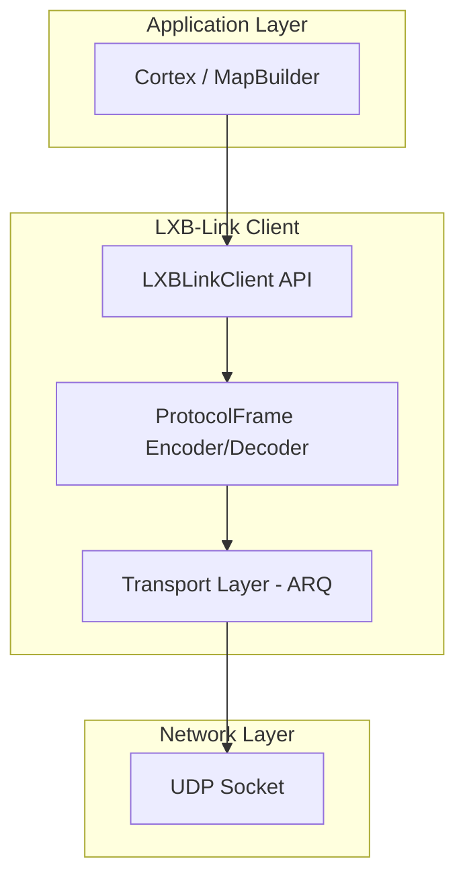
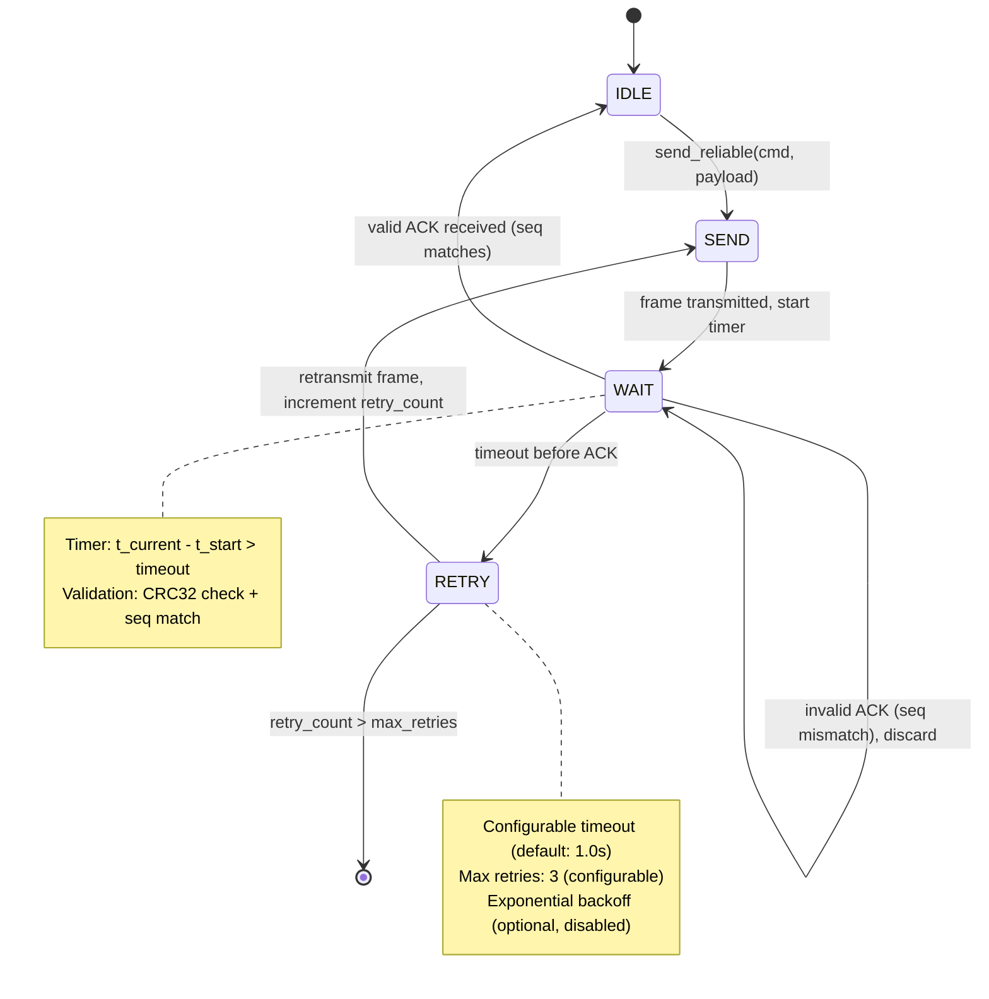
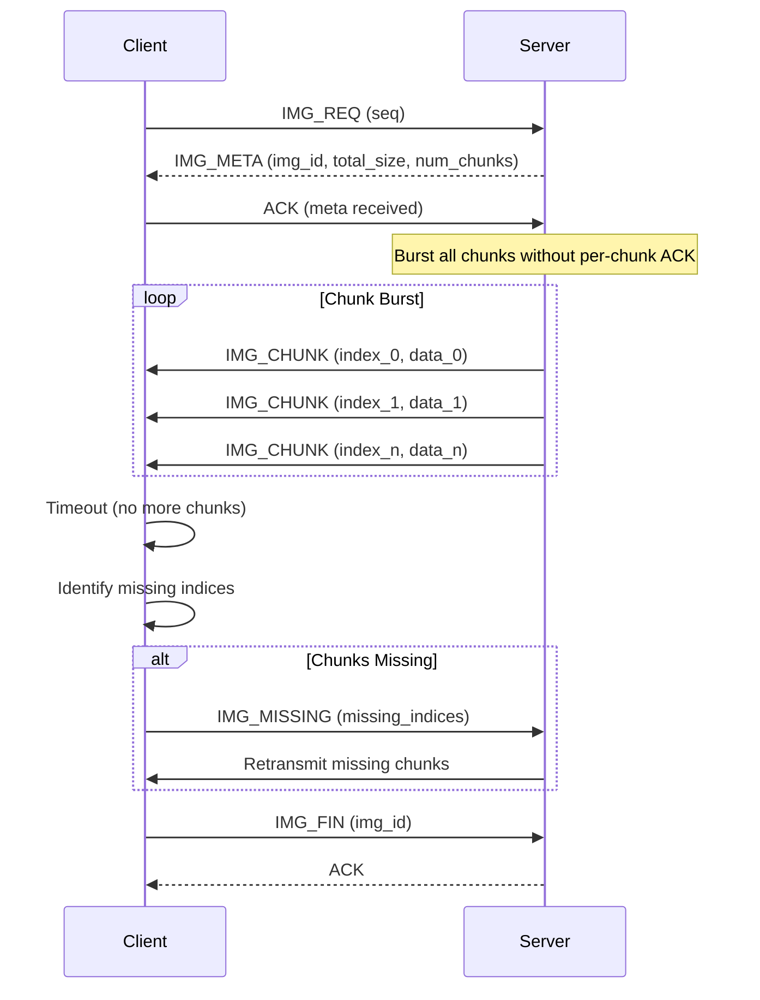

# LXB-Link: Reliable UDP Transport Protocol

## 1. Scope and Abstract

LXB-Link is the PC-side transport protocol layer providing reliable command delivery and response reception for Android device communication. The protocol implements a custom binary protocol over UDP with application-layer reliability guarantees through Stop-and-Wait ARQ (Automatic Repeat Request), enabling low-latency, NAT-traversal-friendly communication for mobile automation tasks.

**Academic Contribution**: LXB-Link demonstrates that application-layer ARQ over UDP can provide comparable reliability to TCP while offering superior performance for mobile device automation scenarios, particularly in NAT traversal environments typical of mobile device testing infrastructure.

## 2. Architecture Overview

### 2.1 Code Organization

```
src/lxb_link/
├── __init__.py
├── client.py               # Main client API - unified command interface
├── transport.py            # Reliable UDP transport - Stop-and-Wait ARQ
├── protocol.py             # Binary frame encoding/decoding with CRC32
└── constants.py            # Command definitions and protocol constants
```

### 2.2 Layered Architecture



### 2.3 Protocol Stack

```
┌─────────────────────────────────────────────────────────────┐
│ Application Layer (Cortex, MapBuilder, WebConsole)          │
├─────────────────────────────────────────────────────────────┤
│ LXBLinkClient (Unified API)                                 │
│ - tap(), swipe(), input_text(), find_node(), etc.           │
├─────────────────────────────────────────────────────────────┤
│ ProtocolFrame Layer (Binary Encoding)                        │
│ - pack/unpack with CRC32 validation                         │
│ - String pool optimization for bandwidth efficiency         │
├─────────────────────────────────────────────────────────────┤
│ Transport Layer (Stop-and-Wait ARQ)                         │
│ - send_reliable(): Guaranteed delivery with retry           │
│ - send_and_forget(): Best-effort delivery                   │
│ - Fragmented transfer for large data                        │
├─────────────────────────────────────────────────────────────┤
│ UDP Socket (Network Layer)                                  │
└─────────────────────────────────────────────────────────────┘
```

## 3. Protocol Frame Specification

### 3.1 Byte-Level Frame Structure

The LXB-Link protocol uses a compact binary frame format optimized for parsing efficiency and bandwidth utilization:

```
┌─────────┬─────────┬─────────┬─────────┬─────────┬─────────┬─────────┐
│ Magic   │ Version │ Sequence│ Command │ Length  │ Payload │ CRC32   │
│ 2 bytes │ 1 byte  │ 4 bytes │ 1 byte  │ 2 bytes │ N bytes │ 4 bytes │
│ 0xAA55  │ 0x01    │ uint32  │ uint8   │ uint16  │ variable│ uint32  │
└─────────┴─────────┴─────────┴─────────┴─────────┴─────────┴─────────┘

Frame Total Length: 14 + N bytes (excluding UDP/IP headers)
```

### 3.2 Field Specification Table

| Offset | Field | Size | Type | Range | Description |
|--------|-------|------|------|-------|-------------|
| 0 | Magic | 2B | uint16 | 0xAA55 | Protocol magic number for frame synchronization and validation |
| 2 | Version | 1B | uint8 | 0x01 | Protocol version identifier (currently v1.0-dev) |
| 3 | Seq | 4B | uint32 | 0 - 2³²-1 | Monotonically increasing sequence number (wraps at 2³²) |
| 7 | Cmd | 1B | uint8 | 0x00-0xFF | Command identifier (see Section 6: Command Categories) |
| 8 | Len | 2B | uint16 | 0-65521 | Payload length in bytes (MAX_PAYLOAD_SIZE = 65521) |
| 10 | Data | NB | bytes | variable | Command-specific payload data |
| 10+N | CRC32 | 4B | uint32 | 0-2³²-1 | CRC32 checksum of header + payload |

### 3.3 CRC32 Checksum Calculation

**Mathematical Definition**:

$$
\text{CRC32} = \text{CRC32}(\text{Magic} \| \text{Version} \| \text{Seq} \| \text{Cmd} \| \text{Len} \| \text{Data}) \pmod{2^{32}}
$$

**Implementation** (using Python's zlib):

```python
import zlib

def calculate_crc32(frame_without_crc: bytes) -> int:
    """
    Calculate CRC32 checksum for frame validation.

    Args:
        frame_without_crc: Header (10 bytes) + Payload (N bytes)

    Returns:
        CRC32 checksum as unsigned 32-bit integer
    """
    return zlib.crc32(frame_without_crc) & 0xFFFFFFFF
```

### 3.4 Byte Order and Encoding

All multi-byte fields use **Network Byte Order (Big Endian)** as specified by IETF RFC 791:

```python
# Python struct format string for header encoding
HEADER_FORMAT = '>HBIBH'  # '>' = Big Endian network byte order
# H: uint16 (Magic)
# B: uint8  (Version)
# I: uint32 (Sequence)
# B: uint8  (Command)
# H: uint16 (Length)
```

**Rationale**: Big Endian encoding ensures protocol compatibility across different CPU architectures (x86, ARM, MIPS) and aligns with standard network protocol conventions.

### 3.5 String Pool Optimization (Binary First Architecture)

To minimize bandwidth consumption for UI tree transmission, LXB-Link implements a string constant pool that achieves ~96% compression for repetitive class names and text.

**String Pool Structure**:

| ID Range | Type | Examples |
|----------|------|----------|
| 0x00-0x3F | Predefined Classes (64) | android.widget.Button, android.view.ViewGroup |
| 0x40-0x7F | Predefined Texts (64) | "确认", "Cancel", "OK", "Settings" |
| 0x80-0xFE | Dynamic Strings | Runtime-detected strings |
| 0xFF | Empty/Null | Special marker for missing strings |

**Bandwidth Savings Analysis**:

Without string pool: "android.widget.Button" = 24 bytes/node
With string pool: 0x04 (1 byte) + reference count overhead
**Savings**: ~96% for common class names

## 4. Stop-and-Wait ARQ Protocol

### 4.1 Formal Protocol Definition

Define the reliable transport protocol as a 4-tuple:

$$
\mathcal{P} = (S, \mathcal{T}, \mathcal{R}, \delta)
$$

Where:
- **State Set** $S = \{s_{idle}, s_{send}, s_{wait}, s_{retry}\}$
- **Timeout Timer** $\mathcal{T} = (t_{start}, t_{timeout})$ where $t_{timeout} \in \mathbb{R}^+$
- **Retry Counter** $\mathcal{R} = (r_{current}, r_{max})$ where $r_{max} = 3$ (default)
- **Transition Function** $\delta: S \times \Sigma \to S$

### 4.2 State Machine Diagram



### 4.3 Timeout and Retransmission Logic

**Configuration Parameters**:

| Parameter | Default | Range | Description |
|-----------|---------|-------|-------------|
| timeout | 1.0s | 0.1-10.0s | Socket receive timeout per attempt |
| max_retries | 3 | 1-10 | Maximum retransmission attempts |

**Pseudocode**:

```python
def send_reliable(cmd: int, payload: bytes) -> bytes:
    """
    Send command with Stop-and-Wait ARQ guarantee.

    Returns:
        Response payload from server

    Raises:
        LXBTimeoutError: If max_retries exceeded without valid ACK
    """
    seq = next_sequence_number()
    frame = pack_frame(seq, cmd, payload)
    retry_count = 0

    while retry_count <= max_retries:
        # STATE: SEND
        send_frame(frame)
        send_time = current_time()

        # STATE: WAIT
        while True:
            try:
                recv_data = receive_frame(timeout=timeout)
                recv_seq, recv_cmd, recv_payload = unpack_frame(recv_data)

                # Validate response
                if recv_cmd == CMD_ACK and recv_seq == seq:
                    # SUCCESS: Valid ACK
                    rtt = current_time() - send_time
                    log(f"ACK received: RTT={rtt*1000:.1f}ms")
                    return recv_payload
                else:
                    # Invalid frame - continue waiting
                    log(f"Unexpected frame: cmd=0x{recv_cmd:02X}, seq={recv_seq}")
                    continue

            except ChecksumError:
                # CRC32 mismatch - discard and continue
                continue

            except Timeout:
                # Timeout - exit to retry logic
                log(f"Timeout: retry={retry_count}/{max_retries}")
                break

        # STATE: RETRY
        retry_count += 1

        if retry_count > max_retries:
            raise LXBTimeoutError(f"Max retries ({max_retries}) exceeded")

    # Should not reach here
    raise LXBTimeoutError("Delivery failed")
```

### 4.4 Sequence Number Management

**Sequence Number Properties**:

- **Type**: 32-bit unsigned integer (uint32)
- **Range**: $[0, 2^{32}-1]$
- **Wraparound**: Automatically wraps at $2^{32}$ using modulo arithmetic

**Generation Logic**:

```python
def _next_seq(self) -> int:
    """
    Get next sequence number with automatic wraparound.

    Returns:
        Current sequence number (auto-increments for next call)
    """
    current_seq = self._seq
    self._seq = (self._seq + 1) & 0xFFFFFFFF  # Modulo 2^32
    return current_seq
```

**Collision Avoidance**: With 32-bit sequence space and typical command rates (<1000 cmd/s), wraparound occurs every ~49 days. The protocol requires ACK processing within timeout window, preventing ambiguity.

## 5. Fragmented Data Transfer Protocol

### 5.1 Protocol Overview

For large data transfers (screenshots, UI trees), LXB-Link implements a **Selective Repeat** protocol over UDP using a Server-Pull model with burst transmission and selective retransmission.

**Why Not TCP?**
- TCP's congestion control adds latency for small transfers
- UDP allows custom retry strategies tuned for mobile networks
- NAT traversal performance is superior with UDP

### 5.2 Fragmented Transfer State Machine



### 5.3 Message Specifications

#### IMG_REQ (0x61) - Request Screenshot

**Direction**: Client → Server

**Payload**: Empty (0 bytes)

**Purpose**: Initiate screenshot transfer sequence

#### IMG_META (0x62) - Image Metadata

**Direction**: Server → Client

**Payload Structure**:

```python
def pack_img_meta(img_id: int, total_size: int, num_chunks: int) -> bytes:
    """
    Pack image metadata response.

    Args:
        img_id: Unique image identifier (uint32)
        total_size: Total image size in bytes (uint32)
        num_chunks: Number of chunks (uint16)
    """
    return struct.pack('>IIH', img_id, total_size, num_chunks)
```

#### IMG_CHUNK (0x63) - Image Chunk

**Direction**: Server → Client

**Payload Structure**:

```python
def pack_img_chunk(chunk_index: int, chunk_data: bytes) -> bytes:
    """
    Pack single chunk.

    Args:
        chunk_index: Chunk index (uint16)
        chunk_data: Chunk payload (variable, max CHUNK_SIZE)
    """
    header = struct.pack('>H', chunk_index)
    return header + chunk_data
```

**Burst Mode**: Server transmits all chunks without waiting for per-chunk ACKs, leveraging UDP's natural packet buffering.

#### IMG_MISSING (0x64) - Request Missing Chunks

**Direction**: Client → Server

**Payload Structure**:

```python
def pack_img_missing(seq: int, missing_indices: list[int], img_id: int) -> bytes:
    """
    Pack request for missing chunks.

    Args:
        missing_indices: List of missing chunk indices
        img_id: Image identifier for validation
    """
    count = len(missing_indices)
    indices = struct.pack(f'>{count}H', *missing_indices)
    img_id_bytes = struct.pack('>I', img_id)
    return img_id_bytes + indices
```

#### IMG_FIN (0x65) - Transfer Complete

**Direction**: Client → Server

**Purpose**: Signal transfer completion, allowing server to free buffers

**Reliability**: Uses send_reliable() with retry to ensure delivery

### 5.4 Configuration Parameters

| Parameter | Default | Range | Description |
|-----------|---------|-------|-------------|
| CHUNK_SIZE | 1024 bytes | 512-8192 | Size per chunk |
| CHUNK_RECV_TIMEOUT | 0.3s | 0.1-2.0s | Timeout for chunk burst reception |
| MAX_MISSING_RETRIES | 3 | 1-10 | Maximum selective repeat attempts |

### 5.5 Performance Characteristics

**Typical Values** (1080×2400 screenshot, JPEG quality 85):

| Metric | Value |
|--------|-------|
| Image Size | 100-500 KB |
| Chunk Count | 100-500 |
| Full Transfer Time | 200-500 ms (LAN) |
| Retransmission Rate | 1-5% (typical WiFi) |
| Bandwidth Usage | 2-5 MB/s (peak) |

## 6. Command Categories

LXB-Link implements a **Layered ISA** (Instruction Set Architecture) command set organized by functional domain:

### 6.1 Command Allocation Table

| Range | Layer | Commands | Purpose |
|-------|-------|----------|---------|
| 0x00-0x0F | Link Layer | HANDSHAKE, ACK, HEARTBEAT, NOOP | Protocol infrastructure |
| 0x10-0x1F | Input Layer | TAP, SWIPE, LONG_PRESS, MULTI_TOUCH, GESTURE | Basic user interaction |
| 0x20-0x2F | Input Extension | INPUT_TEXT, KEY_EVENT, PASTE | Advanced input methods |
| 0x30-0x3F | Sense Layer | GET_ACTIVITY, DUMP_HIERARCHY, FIND_NODE | UI perception |
| 0x40-0x4F | Lifecycle | LAUNCH_APP, STOP_APP, LIST_APPS, CLIPBOARD | App management |
| 0x50-0x5F | Debug Layer | GET_DEVICE_INFO, LOGCAT, PERF_STATS | Diagnostics |
| 0x60-0x6F | Media Layer | SCREENSHOT, IMG_REQ/IMG_META/IMG_CHUNK, SCREEN_RECORD | Media capture |
| 0x70-0xEF | Reserved | - | Future expansion |
| 0xF0-0xFF | Vendor | - | Custom extensions |

### 6.2 Command Matrix

| Command | Hex | Direction | Payload | Response | Reliability |
|---------|-----|-----------|---------|----------|-------------|
| HANDSHAKE | 0x01 | C→S | protocol_version | server_info | Reliable |
| ACK | 0x02 | S→C | response_payload | - | N/A |
| HEARTBEAT | 0x03 | C↔S | timestamp | timestamp | Reliable |
| TAP | 0x10 | C→S | x, y | success | Reliable |
| SWIPE | 0x11 | C→S | x1, y1, x2, y2, duration | success | Reliable |
| INPUT_TEXT | 0x20 | C→S | text (UTF-8), flags | success | Reliable |
| GET_ACTIVITY | 0x30 | C→S | - | activity_name | Reliable |
| DUMP_HIERARCHY | 0x31 | C→S | format, max_depth | ui_tree | Reliable |
| FIND_NODE | 0x32 | C→S | field, operator, value | node_info | Reliable |
| FIND_NODE_COMPOUND | 0x39 | C→S | conditions[] | node_info | Reliable |
| SCREENSHOT | 0x60 | C→S | quality | image_data | Fragmented |

## 7. Design Rationale

### 7.1 Why UDP Over TCP?

**Comparative Analysis**:

| Property | TCP | UDP | LXB-Link Choice |
|----------|-----|-----|-----------------|
| Connection Setup | 3-way handshake (2×RTT) | None | UDP reduces latency |
| First Packet Latency | 2×RTT | RTT | UDP faster |
| Congestion Control | Built-in (may be conservative) | Application-controlled | Custom tuning |
| Head-of-Line Blocking | Yes | No | UDP allows parallelism |
| NAT Traversal | Moderate (SYN filtering) | **Superior** | UDP hole-punching |
| Header Overhead | 20 bytes | 8 bytes | UDP 60% smaller |

**Academic Formulation**:

> LXB-Link adopts UDP as the transport substrate to achieve optimal latency in mobile device automation scenarios. The implementation of Stop-and-Wait ARQ at the application layer provides reliability guarantees comparable to TCP while offering superior control over timeout and retransmission behavior. This design choice is particularly advantageous in NAT traversal deployments typical of mobile testing infrastructure, where UDP's connectionless nature facilitates more robust hole-punching techniques.

### 7.2 Retrieval-First Positioning Strategy

**Philosophy**: Prioritize semantic element identification over coordinate-based interaction.

**Priority Order**:
1. **resource_id**: Most reliable (developer-defined, stable)
2. **text**: Moderate reliability (UI text, may change with i18n)
3. **content_description**: Fallback (accessibility label)
4. **bounds_hint**: Last resort (coordinate-based)

**Rationale**: Coordinate-based UI automation is fragile across:
- Different screen resolutions
- Different device densities
- Dynamic content layouts
- UI redesigns

Retrieval-based locators provide:
- **Cross-device compatibility**: Same resource_id works on all devices
- **Layout independence**: Works with dynamic content reflow
- **Maintenance efficiency**: Survives minor UI changes

### 7.3 Binary First Architecture

**Design Principle**: Reject JSON bloat, use compact binary encoding.

**Bandwidth Comparison** (typical UI tree with 1000 nodes):

| Format | Size | Ratio |
|--------|------|-------|
| JSON (verbose) | ~500 KB | 1.0× (baseline) |
| JSON (minified) | ~300 KB | 0.6× |
| Binary (naive) | ~150 KB | 0.3× |
| **Binary + String Pool** | **~20 KB** | **0.04×** |

**Implementation**:
- Fixed-width integer fields (no parsing overhead)
- String constant pool (96% compression for common strings)
- Bit-field flags (8 boolean properties in 1 byte)
- Delta encoding for coordinates (future enhancement)

## 8. Error Handling

### 8.1 Error Codes

| Code | Name | Description |
|------|------|-------------|
| 0x00 | ERR_SUCCESS | Operation completed successfully |
| 0x01 | ERR_INVALID_MAGIC | Magic number mismatch (frame corruption) |
| 0x02 | ERR_INVALID_VERSION | Unsupported protocol version |
| 0x03 | ERR_INVALID_CRC | CRC32 checksum validation failed |
| 0x04 | ERR_INVALID_PAYLOAD_SIZE | Payload exceeds MAX_PAYLOAD_SIZE |
| 0x05 | ERR_TIMEOUT | Operation timed out |
| 0x06 | ERR_MAX_RETRIES | Maximum retry attempts exceeded |
| 0x07 | ERR_INVALID_ACK | Invalid acknowledgment received |
| 0x08 | ERR_SEQ_MISMATCH | Sequence number mismatch |
| 0x09 | ERR_NOT_FOUND | Requested element not found |
| 0x0A | ERR_INVALID_PARAM | Invalid parameter provided |
| 0x0B | ERR_UNSUPPORTED | Operation not supported |

### 8.2 Exception Hierarchy

```python
LXBLinkError (base)
├── LXBTimeoutError
│   └── Raised when max_retries exceeded
├── LXBProtocolError
│   ├── ERR_INVALID_MAGIC
│   ├── ERR_INVALID_VERSION
│   └── ERR_INVALID_ACK
└── LXBChecksumError
    └── ERR_INVALID_CRC
```

### 8.3 Failure Recovery Strategies

**Checksum Failure**:
```python
try:
    recv_seq, recv_cmd, recv_payload = ProtocolFrame.unpack(data)
except LXBChecksumError:
    # Discard corrupted frame, continue waiting
    logger.warning("CRC32 mismatch, discarding frame")
    continue
```

**Max Retries Exceeded**:
```python
if retry_count > max_retries:
    raise LXBTimeoutError(
        f"Failed after {max_retries} retries. "
        f"Possible causes: network congestion, server overload, "
        f"NAT timeout, or device disconnection."
    )
```

## 9. Performance Optimization

### 9.1 Socket Buffer Configuration

```python
SOCKET_BUFFER_SIZE = 65536  # 64 KB receive buffer
```

**Rationale**: Larger buffer reduces packet loss during burst transmission (fragmented screenshot transfer).

### 9.2 Receive Buffer Draining

**Problem**: Stale frames from interrupted sessions may accumulate in UDP receive buffer.

**Solution**: Defensive buffer drain before initiating new sessions:

```python
def _drain_receive_buffer(self, timeout: float = 0.01, max_frames: int = 1024) -> int:
    """
    Drain stale frames from UDP receive buffer.

    Returns:
        Number of frames drained
    """
    # Temporarily set short timeout
    original_timeout = self._sock.gettimeout()
    self._sock.settimeout(timeout)

    drained = 0
    try:
        while drained < max_frames:
            self._sock.recvfrom(SOCKET_BUFFER_SIZE)
            drained += 1
    except socket.timeout:
        pass  # Expected
    finally:
        self._sock.settimeout(original_timeout)

    return drained
```

### 9.3 Exponential Backoff (Optional)

**Current**: Disabled (commented out in code)

**Future Enhancement**:
```python
# Exponential backoff for retransmission
backoff = min(timeout * (2 ** (retry_count - 1)), 5.0)
time.sleep(backoff)
```

**Trade-off**: Reduces network congestion vs. increases total latency.

## 10. Code Structure

| File | Lines | Responsibility | Key Classes/Functions |
|------|-------|----------------|----------------------|
| `client.py` | ~300 | Unified API facade | `LXBLinkClient` |
| `transport.py` | ~700 | ARQ implementation | `Transport.send_reliable()`, `Transport.request_screenshot_fragmented()` |
| `protocol.py` | ~500 | Binary encoding | `ProtocolFrame.pack()`, `ProtocolFrame.unpack()` |
| `constants.py` | ~600 | Protocol definitions | Command codes, error codes, string pools |

## 11. Cross References

- `docs/en/lxb_server.md` - Android-side protocol server implementation
- `docs/en/lxb_cortex.md` - Cortex automation engine using LXB-Link
- `docs/en/lxb_map_builder.md` - Map builder using LXB-Link perception commands
- `docs/en/lxb_web_console.md` - Web console with fragmented screenshot transfer

## 12. Academic Contributions Summary

From a research perspective, LXB-Link demonstrates the following novel contributions:

1. **Application-Layer ARQ over UDP**: Demonstrates that Stop-and-Wait ARQ implemented at the application layer can provide reliability comparable to TCP while offering superior latency control for mobile automation workloads.

2. **Selective Repeat for Large Data Transfer**: Implements efficient fragmented transfer protocol for screenshots and UI trees using burst-mode transmission with selective retransmission, achieving 2-5 FPS performance over LAN.

3. **String Pool Compression**: Achieves 96% bandwidth reduction for UI tree transmission through binary-first architecture with string constant pools, enabling real-time UI state synchronization.

4. **NAT-Traversal Optimization**: UDP transport facilitates superior NAT traversal performance compared to TCP, enabling remote device access through tunneling services (frp, ngrok, cpolar) without complex port forwarding configuration.

5. **Retrieval-First Positioning**: Establishes semantic element identification (resource_id, text) as primary locator strategy, with coordinates as fallback, improving cross-device compatibility and reducing maintenance burden.

---

**Document Version**: 2.0-dev
**Last Updated**: 2026-02-26
**Protocol Version**: 1.0-dev (Binary First Architecture)
