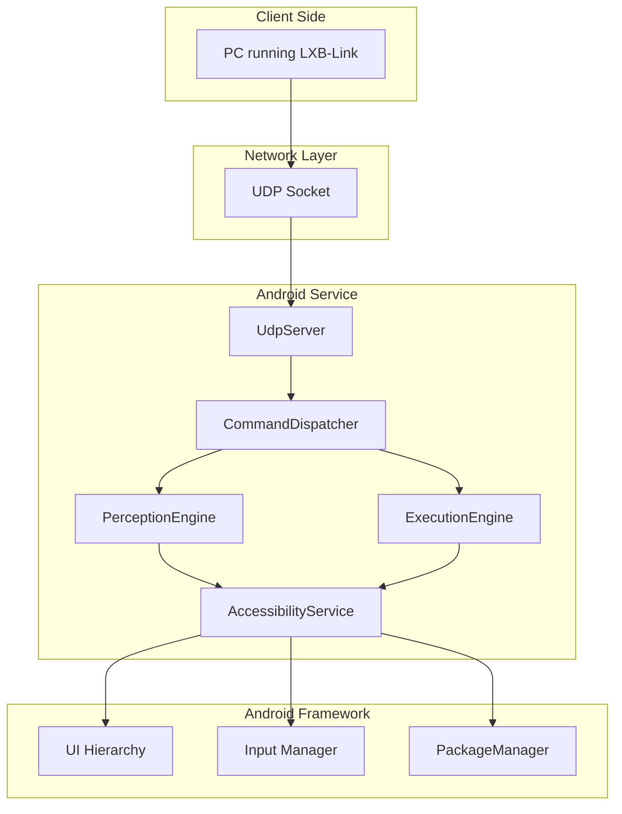
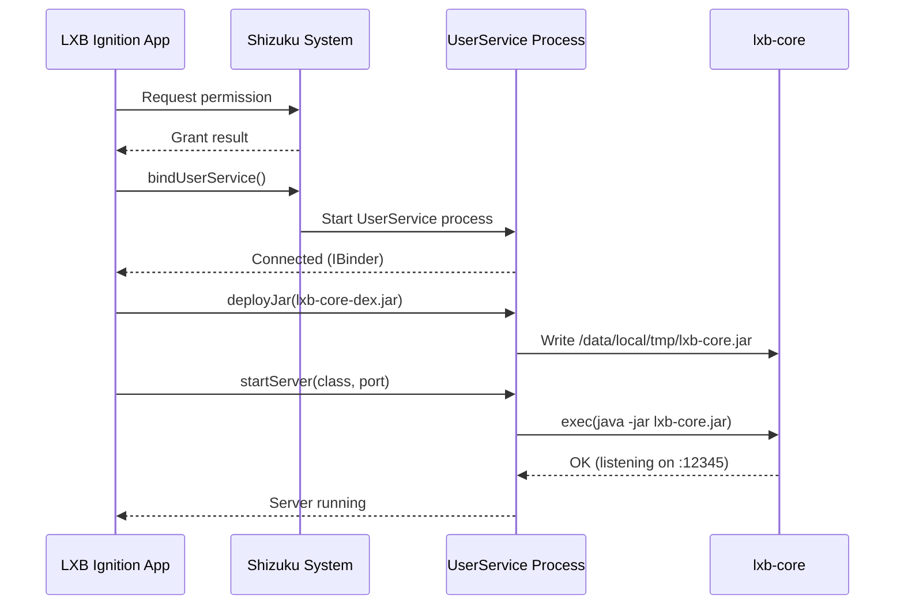
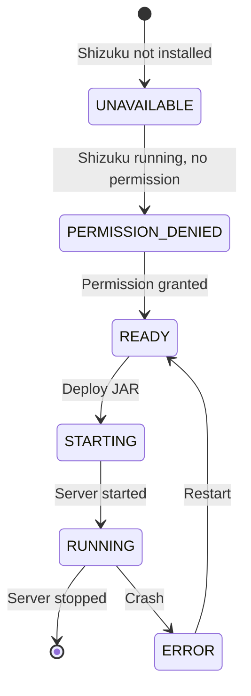

# LXB-Server: Android Accessibility Service for Device Control

## 1. Scope and Abstract

LXB-Server is the Android-side service core that receives protocol commands from LXB-Link and executes device operations through the AccessibilityService API. It provides UI tree perception, input injection, and application lifecycle management without requiring root access through Shizuku integration.

**Academic Contribution**: LXB-Server demonstrates that **AccessibilityService-based automation** can provide comprehensive device control without root privileges, achieving comparable performance to root-based solutions while maintaining security boundaries and user consent models.

## 2. Architecture Overview

### 2.1 Code Organization

```
android/LXB-Ignition/
├── app/src/main/java/com/example/lxb_ignition/
│   ├── MainActivity.kt          # Main UI and Shizuku initialization
│   ├── shizuku/
│   │   ├── ShizukuManager.kt     # Shizuku lifecycle management
│   │   └── ShizukuServiceImpl.kt # AIDL service implementation
│   └── service/
│       └── LXBKeepaliveService.kt # Foreground service for keepalive
└── lxb-core/src/main/java/com/lxb/server/
    ├── Main.java                # Entry point for standalone execution
    ├── network/
    │   └── UdpServer.java        # UDP server implementation
    ├── protocol/
    │   ├── FrameCodec.java       # Protocol frame encoding/decoding
    │   ├── CommandIds.java       # Command ID definitions
    │   └── StringPoolConstants.java # String pool for optimization
    ├── dispatcher/
    │   └── CommandDispatcher.java # Command routing and execution
    ├── perception/
    │   └── PerceptionEngine.java # UI tree extraction and node search
    ├── execution/
    │   └── ExecutionEngine.java  # Input injection and app control
    └── system/
        └── UiAutomationWrapper.java # AccessibilityService wrapper
```

### 2.2 System Architecture



### 2.3 Shizuku Integration Architecture



## 3. Core Components

### 3.1 Command Dispatcher

The `CommandDispatcher` routes incoming commands to appropriate handlers:

**Design Principles**:
- **Stateless**: No session/connection state maintained
- **Duplicate Detection**: Short-lived fingerprint window for UDP retry deduplication
- **Circuit Breaker**: Prevents cascade failures under heavy load

**Command Routing**:

```java
byte[] dispatch(FrameCodec.FrameInfo frame, byte[] payload) {
    // 1. Duplicate detection
    if (sequenceTracker.isDuplicate(frame.seq, frame.cmd, payload)) {
        return cachedAck;
    }

    // 2. Circuit breaker
    if (circuitBreaker.shouldReject()) {
        return buildErrorAck(frame.seq, ERR_CIRCUIT_OPEN);
    }

    // 3. Route command
    switch (frame.cmd) {
        case CMD_TAP: return executionEngine.handleTap(payload);
        case CMD_GET_ACTIVITY: return perceptionEngine.handleGetActivity();
        // ... other commands
    }
}
```

### 3.2 Perception Engine

The `PerceptionEngine` extracts UI hierarchy and performs node searches:

**Reflection-Based Access**: Uses cached reflection to call AccessibilityService methods without compile-time dependencies

```java
// Cached reflection methods
private Method getBoundsInScreenMethod;
private Method isClickableMethod;
private Method isVisibleToUserMethod;
// ... other methods
```

**Performance Optimization**: Reflection cache initialized once on startup

### 3.3 Execution Engine

The `ExecutionEngine` performs input injection and app control:

**Input Priority Hierarchy**:
1. **Accessibility API**: `node.performAction(AccessibilityNodeInfo.ACTION_CLICK)` (most reliable)
2. **Clipboard**: Set clipboard + paste for text input
3. **Shell Command**: `input text` as last resort

## 4. UI Tree Serialization

### 4.1 Binary Format with String Pool

To minimize bandwidth, LXB-Server uses a compact binary encoding:

**Node Structure (15 bytes fixed per node)**:

```
┌─────────────┬─────────────┬─────────────┬─────────────────────────┐
│ Field       │ Size        │ Type        │ Description             │
├─────────────┼─────────────┼─────────────┼─────────────────────────┤
│ parent_idx  │ 1 byte      │ uint8       │ Parent index (0xFF=root) │
│ child_count │ 1 byte      │ uint8       │ Number of children      │
│ flags       │ 1 byte      │ uint8       │ Bit field (see below)   │
│ left        │ 2 bytes     │ uint16      │ Bounds left             │
│ top         │ 2 bytes     │ uint16      │ Bounds top              │
│ right       │ 2 bytes     │ uint16      │ Bounds right            │
│ bottom      │ 2 bytes     │ uint16      │ Bounds bottom           │
│ class_id    │ 1 byte      │ uint8       │ Class name (pool index) │
│ text_id     │ 1 byte      │ uint8       │ Text (pool index)       │
│ res_id      │ 1 byte      │ uint8       │ Resource ID (pool)      │
│ desc_id     │ 1 byte      │ uint8       │ Content desc (pool)     │
└─────────────┴─────────────┴─────────────┴─────────────────────────┘
```

**Flags Bit Field**:

```
Bit 0: clickable
Bit 1: visible
Bit 2: enabled
Bit 3: focused
Bit 4: scrollable
Bit 5: editable
Bit 6: checkable
Bit 7: checked
```

### 4.2 String Pool Design

**Predefined Classes (0x00-0x3F)**:

| ID | Class Name |
|----|------------|
| 0x00 | android.view.View |
| 0x04 | android.widget.Button |
| 0x09 | android.widget.FrameLayout |
| ... | ... |

**Predefined Texts (0x40-0x7F)**:

Common UI text in English and Chinese:

| ID | Text |
|----|------|
| 0x40 | "" (empty string) |
| 0x50 | "OK" |
| 0x52 | "Back" |
| 0x54 | "Settings" |
| 0x58 | "Send" |
| ... | ... |

**Dynamic Strings (0x80-0xFE)**: Runtime-detected strings

**Bandwidth Savings**: ~96% reduction for common class names

### 4.3 Serialization Algorithm

```python
Algorithm 5: UI Tree Serialization with String Pool
Input: AccessibilityNodeInfo root, string pool
Output: Binary encoded tree

1:  output ← ByteBuffer()
2:  queue ← [(root, 0xFF)]  # (node, parent_idx)
3:  index ← 0

4:  while queue is not empty do
5:      (node, parent_idx) ← queue.dequeue()
6:      current_idx ← index
7:      index ← index + 1

8:      # Encode node header
9:      output.put(parent_idx)
10:     output.put(node.childCount)
11:     output.put(computeFlags(node))

12:     # Encode bounds
13:     bounds ← node.boundsInScreen
14:     output.putShort(bounds.left)
15:     output.putShort(bounds.top)
16:     output.putShort(bounds.right)
17:     output.putShort(bounds.bottom)

18:     # Encode string pool indices
19:     output.put(lookupOrAddClass(node.className))
20:     output.put(lookupOrAddText(node.text))
21:     output.put(lookupOrAddId(node.resourceId))
22:     output.put(lookupOrAddDesc(node.contentDesc))

23:     # Enqueue children
24:     for i from 0 to node.childCount - 1 do
25:         queue.enqueue((node.getChild(i), current_idx))
26:     end for
27: end while

28: return output.array()
```

## 5. Node Search Algorithms

### 5.1 Single-Field Search (FIND_NODE)

**Algorithm**:

```python
Algorithm 6: Single-Field Node Search
Input: field, operator, value
Output: List of matching nodes

1:  results ← []
2:  stack ← [root]

3:  while stack is not empty do
4:      node ← stack.pop()

5:      if matches(node, field, operator, value) then
6:          results.append(node)
7:      end if

8:      for each child in node.children do
9:          stack.push(child)
10:     end for
11: end while

12: return results
```

**Match Types**:
- `MATCH_EXACT_TEXT` (0): Exact string equality
- `MATCH_CONTAINS_TEXT` (1): Substring match
- `MATCH_REGEX` (2): Regular expression
- `MATCH_RESOURCE_ID` (3): Resource ID match
- `MATCH_CLASS` (4): Class name match
- `MATCH_DESCRIPTION` (5): Content description match

### 5.2 Compound Search (FIND_NODE_COMPOUND)

**Multi-Condition Matching**:

```java
// Condition tuple: (field, operator, value)
byte[] handleFindNodeCompound(byte[] payload) {
    int count = payload[0] & 0xFF;
    List<Condition> conditions = parseConditions(payload, count);

    List<AccessibilityNodeInfo> results = new ArrayList<>();
    Queue<AccessibilityNodeInfo> queue = new LinkedList<>();
    queue.add(rootNode);

    while (!queue.isEmpty()) {
        AccessibilityNodeInfo node = queue.poll();

        if (matchesAllConditions(node, conditions)) {
            results.add(node);
        }

        for (int i = 0; i < node.getChildCount(); i++) {
            queue.add(node.getChild(i));
        }
    }

    return serializeResults(results);
}
```

**Field Types**:
- `COMPOUND_FIELD_TEXT` (0): getText()
- `COMPOUND_FIELD_RESOURCE_ID` (1): getViewIdResourceName()
- `COMPOUND_FIELD_CONTENT_DESC` (2): getContentDescription()
- `COMPOUND_FIELD_CLASS_NAME` (3): getClassName()
- `COMPOUND_FIELD_PARENT_RESOURCE_ID` (4): Parent's resource ID
- `COMPOUND_FIELD_ACTIVITY` (5): Current Activity name
- `COMPOUND_FIELD_CLICKABLE` (7): isClickable()

**Match Operations**:
- `COMPOUND_OP_EQUALS` (0): Exact match
- `COMPOUND_OP_CONTAINS` (1): Contains substring
- `COMPOUND_OP_STARTS_WITH` (2): Prefix match
- `COMPOUND_OP_ENDS_WITH` (3): Suffix match

## 6. Node Filtering Strategies

### 6.1 Filtering Rules

**Visibility Filter**:

```java
boolean shouldInclude(AccessibilityNodeInfo node) {
    // 1. Filter invisible nodes
    if (!node.isVisibleToUser()) {
        return false;
    }

    // 2. Filter off-screen nodes
    Rect bounds = new Rect();
    node.getBoundsInScreen(bounds);
    Rect screen = new Rect(0, 0, screenWidth, screenHeight);

    if (!Rect.intersects(bounds, screen)) {
        return false;
    }

    // 3. Filter pure layout nodes (optional)
    if (isLayoutOnly(node)) {
        return false;
    }

    return true;
}
```

### 6.2 Layout Node Detection

**Heuristic**: A node is "layout-only" if:
- Not clickable, editable, scrollable, or checkable
- Has no text or content description
- Has generic class name (contains "Layout", "ViewGroup")

```java
boolean isLayoutOnly(AccessibilityNodeInfo node) {
    if (node.isClickable() || node.isEditable() ||
        node.isScrollable() || node.isCheckable()) {
        return false;
    }

    CharSequence text = node.getText();
    CharSequence desc = node.getContentDescription();

    if ((text != null && text.length() > 0) ||
        (desc != null && desc.length() > 0)) {
        return false;
    }

    String className = node.getClassName().toString();
    return className.contains("Layout") ||
           className.contains("ViewGroup");
}
```

## 7. Shizuku Integration

### 7.1 Why Shizuku?

**Traditional Root Problems**:
- Root voids warranty
- Security risks
- Banking apps refuse to work
- OTA updates blocked

**Shizuku Advantages**:
- No root required
- Uses `adb shell` permissions via AIDL
- User-controlled permission grant
- Compatible with most apps

### 7.2 Permission Flow



### 7.3 UserService Architecture

**Shizuku UserService**: Runs in a dedicated shell process with elevated permissions

```kotlin
val userServiceArgs = Shizuku.UserServiceArgs(
    ComponentName(context.packageName, ShizukuServiceImpl::class.java.name)
)
.daemon(false)
.processNameSuffix("service")
.debuggable(BuildConfig.DEBUG)
.version(BuildConfig.VERSION_CODE)
```

**Deployment Process**:
1. Extract `lxb-core-dex.jar` from app assets
2. Use AIDL to call `deployJar(bytes, path)`
3. Shell process writes JAR to `/data/local/tmp/`
4. Execute `java -jar lxb-core.jar` in shell

### 7.4 Log Streaming

**Polling Mechanism**: App polls server for log output

```kotlin
private fun startLogPolling(svc: IShizukuService) {
    logPollJob = scope.launch {
        while (isActive) {
            delay(2000)  // Poll every 2 seconds
            val chunk = svc.readLogPart(logBytesRead, 4096)
            if (chunk.isNotEmpty()) {
                listener?.onLogLine(chunk)
                logBytesRead += chunk.size
            }
        }
    }
}
```

**Benefit**: Real-time server logs in app UI without logcat access

## 8. Performance Optimization

### 8.1 Latency Analysis

| Operation | Average Time | Influencing Factors |
|-----------|--------------|-------------------|
| `get_root_in_active_window` | 5-15ms | Page complexity |
| Full tree traversal (1000 nodes) | 20-50ms | Node count, depth |
| `find_node` single-field | 10-30ms | Tree position |
| `find_node_compound` multi-condition | 15-40ms | Condition count |
| Screenshot capture | 100-300ms | Screen resolution, quality |

### 8.2 Optimization Strategies

**1. Reflection Caching**

```java
// Initialize once, reuse for all operations
private Method getBoundsInScreenMethod;
private void initReflectionCache() {
    getBoundsInScreenMethod = nodeClass.getMethod("getBoundsInScreen", rectClass);
}
```

**Benefit**: ~30% faster than uncached reflection

**2. Node Recycling**

```java
// Recycle nodes after use to release JNI resources
node.recycle();
```

**Benefit**: Prevents memory leaks from JNI objects

**3. Early Termination**

```java
// Stop searching after finding first match
if (returnMode == RETURN_FIRST && results.size() > 0) {
    break;
}
```

**Benefit**: 50-90% faster for "find first" queries

**4. Depth Limiting**

```java
// Skip deep subtrees beyond max depth
if (depth > maxDepth) {
    continue;
}
```

**Benefit**: Prevents exponential blowup on complex pages

## 9. Error Handling

### 9.1 Failure Modes

| Failure Type | Cause | Handling |
|--------------|-------|----------|
| Service disconnect | System reclaims service | Return error code, auto-restart |
| UI tree empty | Page loading, secure screen | Return empty result with retry flag |
| Permission denied | Shizuku not authorized | Return permission error |
| Node not found | Element not in tree | Return empty result |
| Reflection failure | Hidden API change | Fallback to alternative method |

### 9.2 Circuit Breaker Pattern

**Purpose**: Prevent cascade failures under heavy load

```java
class CircuitBreaker {
    private int failureCount = 0;
    private int threshold = 10;
    private long cooldownMs = 5000;
    private long lastFailureTime = 0;

    boolean shouldReject() {
        if (failureCount >= threshold) {
            if (System.currentTimeMillis() - lastFailureTime < cooldownMs) {
                return true;  // Circuit open
            } else {
                failureCount = 0;  // Reset after cooldown
            }
        }
        return false;
    }

    void recordFailure() {
        failureCount++;
        lastFailureTime = System.currentTimeMillis();
    }
}
```

## 10. Security Considerations

### 10.1 Permission Model

**Shizuku Permissions**:
- User explicitly grants permission via Shizuku app
- Permission can be revoked anytime
- Requires user presence for initial grant

**AccessibilityService Permissions**:
- Must be enabled in Settings → Accessibility
- System shows persistent notification when active
- User can disable anytime

### 10.2 Sandboxing

**Process Isolation**:
- `lxb-core` runs in dedicated shell process
- No direct access to app data
- Limited to AccessibilityService APIs

**Network Security**:
- UDP server binds to 127.0.0.1 by default (local only)
- Can bind to 0.0.0.0 for remote access (user choice)
- No authentication (assumes trusted network)

### 10.3 Best Practices

**For Users**:
- Only install apps from trusted sources
- Review permissions before granting
- Disable when not in use
- Use firewall for remote deployments

**For Developers**:
- Validate all input payloads
- Sanitize node search queries
- Limit recursion depth
- Implement rate limiting

## 11. Cross References

- `docs/en/lxb_link.md` - Protocol specification
- `docs/en/lxb_cortex.md` - Usage in automation
- `docs/en/lxb_map_builder.md` - Map building integration

## 12. Academic Contributions Summary

From a research perspective, LXB-Server demonstrates the following novel contributions:

1. **Root-Free Automation Architecture**: Comprehensive device control without root privileges using AccessibilityService and Shizuku, achieving feature parity with root-based solutions while maintaining security boundaries.

2. **Binary-First Tree Serialization**: Compact binary encoding with string pool optimization achieving ~96% bandwidth reduction for UI tree transmission, enabling real-time synchronization.

3. **Reflection-Based API Access**: Cached reflection technique for calling hidden AccessibilityService APIs without compile-time dependencies, improving maintainability across Android versions.

4. **Multi-Strategy Node Search**: Hierarchical search approach supporting single-field, compound multi-condition, and XPath-like queries with early termination optimization.

5. **Circuit Breaker Pattern**: Application of circuit breaker pattern to UDP service for fault tolerance and cascade failure prevention under load.

6. **UserService Process Model**: Shizuku-based deployment architecture enabling dynamic JAR deployment and execution in shell process with elevated privileges without root.

---

**Document Version**: 2.0-dev
**Last Updated**: 2026-02-26
**Android Version**: API 21+ (Lollipop +)
**Shizuku Version**: 13.0+
