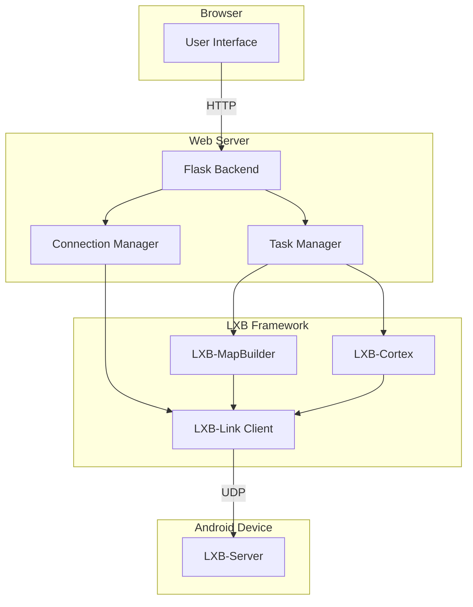
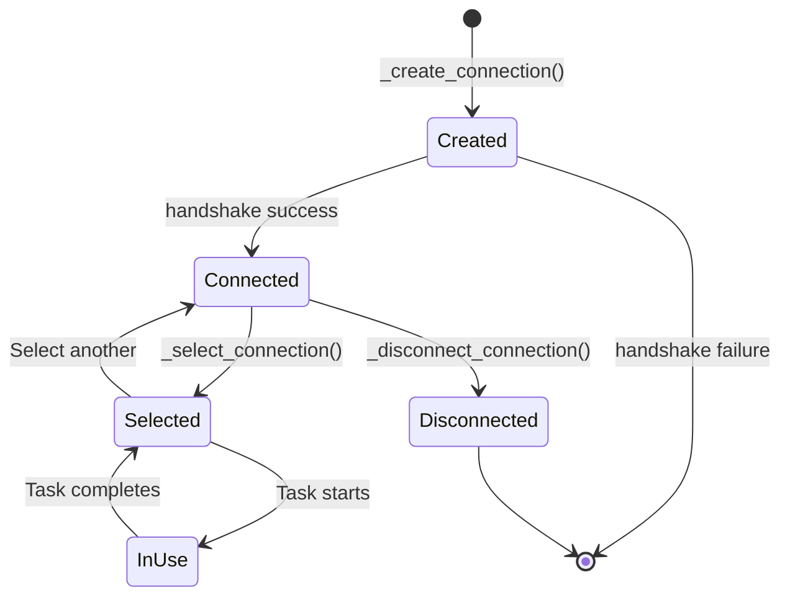
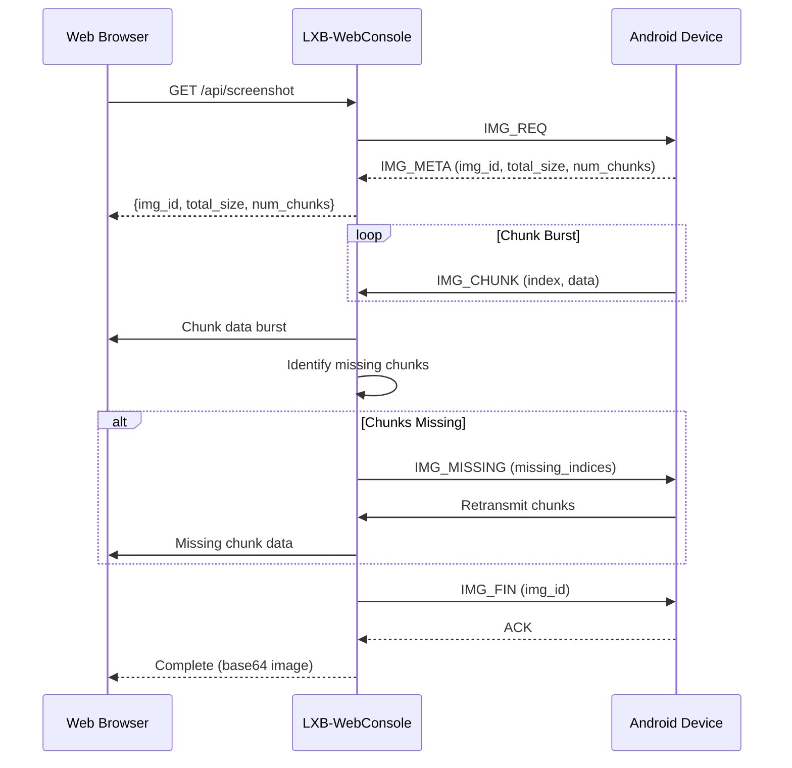

# LXB-WebConsole: Unified Web Interface for Device Management

## 1. Scope and Abstract

LXB-WebConsole is the unified web entry point providing interfaces for connection management, command debugging, map building, map viewing, and Cortex automation execution. Built with Flask backend and JavaScript frontend, it enables real-time device interaction through HTTP APIs with device-level locking for concurrent operation safety.

**Academic Contribution**: LXB-WebConsole demonstrates a **web-based automation orchestration** architecture that enables remote device control with real-time feedback, implementing device-level locking mechanisms that prevent command collisions during multi-threaded automation tasks.

## 2. Architecture Overview

### 2.1 Code Organization

```
web_console/
├── app.py                      # Flask backend service
├── templates/                  # HTML templates
│   ├── index.html              # Connection status page
│   ├── command_studio.html     # Command debugging interface
│   ├── map_builder.html        # Auto map building interface
│   ├── map_viewer.html         # Map visualization and editing
│   └── cortex_route.html       # Route executor interface
└── static/
    └── js/
        └── main.js              # Frontend interaction logic
```

### 2.2 System Architecture



### 2.3 Module Relationships

```
┌─────────────────────────────────────────────────────────────┐
│ Web Browser (User Interface)                                │
│                                                              │
│  ┌──────────┐  ┌──────────────┐  ┌──────────┐  ┌────────┐ │
│  │ Connect  │  │ Command      │  │ Map      │  │ Cortex │ │
│  │ Device   │  │ Studio       │  │ Builder  │  │ Route  │ │
│  └────┬─────┘  └──────┬───────┘  └────┬─────┘  └───┬────┘ │
└───────┼───────────────┼───────────────┼────────────┼───────┘
        │               │               │            │
        ▼               ▼               ▼            ▼
┌─────────────────────────────────────────────────────────────┐
│ Flask Backend (app.py)                                       │
│                                                              │
│  ┌─────────────┐  ┌─────────────┐  ┌─────────────────┐    │
│  │ Connection  │  │ Task        │  │ Config          │    │
│  │ Manager     │  │ Manager     │  │ Manager         │    │
│  └──────┬──────┘  └──────┬──────┘  └────────┬────────┘    │
└─────────┼─────────────────┼──────────────────┼──────────────┘
          │                 │                  │
          ▼                 ▼                  ▼
┌─────────────────────────────────────────────────────────────┐
│ LXB Framework Modules                                       │
│  ┌──────────┐  ┌──────────────┐  ┌──────────┐              │
│  │ LXB-Link │  │ LXB-MapBuilder│  │LXC-Cortex│              │
│  └────┬─────┘  └──────┬───────┘  └────┬─────┘              │
└───────┼─────────────────┼──────────────────┼───────────────┘
        │                 │                  │
        ▼                 ▼                  ▼
┌─────────────────────────────────────────────────────────────┐
│ Android Device (LXB-Server)                                  │
└─────────────────────────────────────────────────────────────┘
```

## 3. Connection Management

### 3.1 Multi-Device Connection Architecture

**Connection Record Structure**:

```python
@dataclass
class ConnectionRecord:
    connection_id: str           # Unique UUID
    host: str                    # Device IP address
    port: int                    # UDP port
    source: str                  # 'manual' or 'auto'
    client: LXBLinkClient        # LXB-Link client instance
    created_at: str              # ISO timestamp
    last_seen: str               # Last activity timestamp
    status: str                  # 'connected', 'disconnected'
    running_tasks: int           # Active task count
    lock: threading.RLock        # Device-level lock
```

**Global State**:

```python
CONNECTIONS: Dict[str, ConnectionRecord] = {}  # All connections
CONNECTIONS_LOCK = threading.RLock()            # Protects CONNECTIONS
CURRENT_CONNECTION_ID: Optional[str] = None     # Active connection
```

### 3.2 Connection Lifecycle



### 3.3 Device-Level Locking

**Purpose**: Prevent command collisions when multiple operations target the same device

**Implementation**:

```python
def execute_on_device(connection_id: str, operation: Callable):
    """
    Execute operation with device-level locking.

    Ensures that only one operation can execute on a device at a time.
    """
    record = _get_connection(connection_id)

    with record.lock:  # Acquire device lock
        record.running_tasks += 1
        try:
            result = operation(record.client)
            return result
        finally:
            record.running_tasks -= 1
```

**Lock Properties**:
- **Reentrant**: Same thread can acquire multiple times
- **Exclusive**: Only one thread holds lock at a time
- **Per-Device**: Each device has independent lock

## 4. Screen Mirroring

### 4.1 Fragmented Transfer Protocol

**Protocol**: HTTP-based fragmented transfer (not MJPEG, not WebSocket)

**Why This Approach**:
- HTTP compatibility - no additional protocol negotiation
- Fragmented transfer handles large images (avoids 2MB limit)
- Selective retransmission improves reliability
- Works through HTTP proxies

### 4.2 Transfer Flow



### 4.3 API Endpoint

```python
@app.route('/api/screenshot', methods=['GET'])
def get_screenshot():
    """
    Get current screenshot via fragmented transfer.

    Returns:
        JSON with:
        - success: boolean
        - image: base64-encoded JPEG
        - width: image width
        - height: image height
        - size: image size in bytes
    """
    record = _get_connection()
    with record.lock:
        image_data = record.client.request_screenshot_fragmented()

    # Encode to base64 for JSON transport
    image_b64 = base64.b64encode(image_data).decode('utf-8')

    return jsonify({
        'success': True,
        'image': image_b64,
        'size': len(image_data)
    })
```

### 4.4 Performance Characteristics

| Metric | Value | Notes |
|--------|-------|-------|
| Chunk size | 32KB | Balance efficiency vs. packet loss |
| Typical chunks | 30-60 | For 1080×2400 JPEG at quality 85 |
| Transfer time | 200-500ms | LAN conditions |
| Frame rate | 2-5 FPS | Polling at 500ms intervals |
| Bandwidth | 500KB-2MB | Per frame (depends on content) |

## 5. Command Execution

### 5.1 Command Studio API

**Endpoint**: `POST /api/command/execute`

**Request Format**:

```json
{
  "command": "tap",
  "params": {
    "x": 500,
    "y": 800
  },
  "connection_id": "optional-uuid"
}
```

**Supported Commands**:
- `tap`: Single tap at (x, y)
- `swipe`: Swipe from (x1, y1) to (x2, y2) with duration
- `input_text`: Input text string
- `key_event`: Send key event (HOME, BACK, ENTER)
- `get_activity`: Get current activity
- `dump_actions`: Dump interactive nodes

### 5.2 Execution Flow with Locking

```python
@app.route('/api/command/execute', methods=['POST'])
def execute_command():
    """
    Execute command on connected device with device-level locking.

    Ensures thread-safe command execution when multiple requests
    target the same device concurrently.
    """
    data = request.get_json()
    command = data.get('command')
    params = data.get('params', {})
    connection_id = data.get('connection_id')

    record = _get_connection(connection_id)

    def execute(client):
        if command == 'tap':
            return client.tap(params['x'], params['y'])
        elif command == 'swipe':
            return client.swipe(
                params['x1'], params['y1'],
                params['x2'], params['y2'],
                params.get('duration', 300)
            )
        # ... other commands

    # Execute with device lock
    with record.lock:
        result = execute(record.client)
        record.last_seen = _now_iso()

    return jsonify({'success': True, 'result': result})
```

## 6. Map Building Interface

### 6.1 Map Builder API

**Start Exploration**:

```python
@app.route('/api/explore/start', methods=['POST'])
def start_exploration():
    """
    Start automatic map building.

    Returns:
        JSON with task_id for progress tracking
    """
    data = request.get_json()
    package_name = data.get('package_name')
    config = data.get('config', {})

    record = _get_connection()

    task_id = _task_create('explore', record.connection_id)

    def explore_task():
        with record.lock:
            from src.auto_map_builder.node_explorer import NodeMapBuilder

            builder = NodeMapBuilder(
                client=record.client,
                vlm_engine=_get_vlm_engine(),
                config=config
            )

            nav_map = builder.explore(package_name)

            # Save map to file
            map_path = f"maps/{package_name}.json"
            save_map(nav_map, map_path)

            _task_finish(task_id, success=True, result={
                'map_path': map_path,
                'pages': len(nav_map.pages),
                'transitions': len(nav_map.transitions)
            })

    # Run in background thread
    threading.Thread(target=explore_task, daemon=True).start()

    return jsonify({'success': True, 'task_id': task_id})
```

**Progress Polling**:

```python
@app.route('/api/explore/progress/<task_id>', methods=['GET'])
def get_explore_progress(task_id):
    """
    Get exploration progress.

    Returns:
        JSON with current progress, screenshots, and discovered nodes
    """
    with TASKS_LOCK:
        task = TASKS.get(task_id)

    return jsonify({
        'status': task['status'],
        'events': task['events'][-10:],  # Last 10 events
        'done': task['done'],
        'success': task.get('success', False)
    })
```

### 6.2 Real-Time Updates

**Polling Approach**: Frontend polls progress endpoint every 500ms

```javascript
// Frontend polling
const pollInterval = setInterval(async () => {
    const response = await fetch(`/api/explore/progress/${taskId}`);
    const data = await response.json();

    updateProgress(data);

    if (data.done) {
        clearInterval(pollInterval);
    }
}, 500);
```

**Future Enhancement**: WebSocket for server-push updates

## 7. Cortex Route Execution

### 7.1 Route Execution API

**Submit Task**:

```python
@app.route('/api/cortex/submit', methods=['POST'])
def submit_cortex_task():
    """
    Submit Route-Then-Act automation task.

    Returns:
        JSON with task_id for tracking
    """
    data = request.get_json()
    user_task = data.get('user_task')
    map_path = data.get('map_path')
    connection_id = data.get('connection_id')

    record = _get_connection(connection_id)

    task_id = _task_create('cortex', record.connection_id, user_task)

    def cortex_task():
        with record.lock:
            from src.cortex.fsm_runtime import CortexFSMEngine

            engine = CortexFSMEngine(
                client=record.client,
                llm_planner=_get_llm_planner()
            )

            result = engine.run(
                user_task=user_task,
                map_path=map_path
            )

            _task_finish(
                task_id,
                success=result['status'] == 'success',
                result=result
            )

    threading.Thread(target=cortex_task, daemon=True).start()

    return jsonify({'success': True, 'task_id': task_id})
```

### 7.2 Status Tracking

**Task States**:
- `created`: Task queued
- `running`: Task executing
- `done`: Task completed
- `failed`: Task failed

**Event Types**:
- `state_change`: FSM state transition
- `route_step`: Navigation step executed
- `vision_turn`: VLM action executed
- `error`: Error occurred
- `complete`: Task finished

## 8. Configuration Management

### 8.1 Cortex LLM Configuration

**Configuration File**: `.cortex_llm_planner.json`

**Default Configuration**:

```python
_default_cortex_llm_config() = {
    # LLM API Settings
    'api_base_url': os.getenv('CORTEX_LLM_API_BASE_URL', ''),
    'api_key': os.getenv('CORTEX_LLM_API_KEY', ''),
    'model_name': os.getenv('CORTEX_LLM_MODEL_NAME', 'qwen-plus'),
    'temperature': float(os.getenv('CORTEX_LLM_TEMPERATURE', '0.1')),
    'timeout': int(os.getenv('CORTEX_LLM_TIMEOUT', '30')),

    # VLM Settings
    'vision_jpeg_quality': int(os.getenv('CORTEX_VISION_JPEG_QUALITY', '35')),

    # Route/FSM Settings
    'map_filepath': '',
    'package_name': '',
    'reconnect_before_run': True,
    'use_llm_planner': True,
    'route_recovery_enabled': False,
    'max_route_restarts': 0,
    'use_vlm_takeover': False,

    # FSM Runtime
    'fsm_max_turns': 40,
    'fsm_max_vision_turns': 20,
    'fsm_action_interval_sec': 0.8,
    'fsm_tap_jitter_sigma_px': 2.0,
    'fswipe_jitter_sigma_px': 4.0,
    'fsm_xml_stable_samples': 4,
    'fsm_xml_stable_timeout_sec': 4.0,
}
```

**API Endpoints**:

```python
@app.route('/api/config/cortex', methods=['GET'])
def get_cortex_config():
    """Get current Cortex LLM configuration."""
    return jsonify(_load_cortex_llm_config())

@app.route('/api/config/cortex', methods=['POST'])
def save_cortex_config():
    """Save Cortex LLM configuration."""
    config = request.get_json()
    _save_cortex_llm_config(config)
    return jsonify({'success': True})
```

## 9. Concurrency Model

### 9.1 Threading Architecture

**Main Thread**: Flask request handling

**Background Threads**: Task execution (explore, cortex)

**Thread Safety**:
- `CONNECTIONS_LOCK`: Protects connection dict
- `TASKS_LOCK`: Protects task dict
- `record.lock`: Per-device reentrant lock

### 9.2 Lock Ordering

**Deadlock Prevention**: Always acquire locks in consistent order

```
1. CONNECTIONS_LOCK (if accessing CONNECTIONS)
2. record.lock (if accessing device)
```

**Never**:
```
1. record.lock
2. CONNECTIONS_LOCK  # May deadlock!
```

### 9.3 Task Threading

**Task Execution Pattern**:

```python
def run_task_async(task_func, task_id):
    """Run task in background thread with proper locking."""

    def wrapper():
        try:
            result = task_func()
            _task_finish(task_id, True, result=result)
        except Exception as e:
            _task_finish(task_id, False, message=str(e))

    thread = threading.Thread(target=wrapper, daemon=True)
    thread.start()

    return task_id
```

**Daemon Threads**: Background threads marked as daemon to allow clean shutdown

## 10. Error Handling

### 10.1 Error Response Format

```json
{
  "success": false,
  "message": "Error description",
  "code": "ERROR_CODE",
  "details": {}
}
```

### 10.2 Common Error Codes

| Code | Description |
|------|-------------|
| `device_not_connected` | No active device connection |
| `device_not_found` | Specified connection_id not found |
| `command_failed` | Command execution failed on device |
| `task_not_found` | Task ID not found |
| `invalid_config` | Invalid configuration parameters |

### 10.3 Exception Handling

```python
@app.route('/api/command/execute', methods=['POST'])
def execute_command():
    try:
        record = _get_connection()  # May raise RuntimeError

        with record.lock:
            result = execute_command(record.client, data)

        return jsonify({'success': True, 'result': result})

    except RuntimeError as e:
        return jsonify({'success': False, 'message': str(e)}), 400
    except Exception as e:
        logger.error(f"Command execution failed: {e}")
        return jsonify({'success': False, 'message': 'Internal error'}), 500
```

## 11. Frontend Architecture

### 11.1 UI Pages

| Page | Route | Function |
|------|-------|----------|
| Status Dashboard | `/` | Connection list, device info |
| Command Studio | `/command_studio` | Send commands, view results |
| Map Builder | `/map_builder` | Auto map building, progress |
| Map Viewer | `/map_viewer` | Map visualization, editing |
| Cortex Route | `/cortex_route` | Task submission, monitoring |

### 11.2 JavaScript Modules

**Main Modules**:
- `connection.js`: Device connection management
- `command.js`: Command execution and result display
- `screenshot.js`: Screen mirroring with polling
- `mapBuilder.js`: Map building progress tracking
- `cortex.js`: Task submission and status monitoring

## 12. Cross References

- `docs/en/lxb_link.md` - Device communication protocol
- `docs/en/lxb_map_builder.md` - Map building integration
- `docs/en/lxb_cortex.md` - Automation execution

## 13. Academic Contributions Summary

From a research perspective, LXB-WebConsole demonstrates the following novel contributions:

1. **Web-Based Automation Orchestration**: HTTP-based architecture for remote device control enabling cross-platform automation without native client applications.

2. **Device-Level Locking Mechanism**: Per-device reentrant locking preventing command collisions during concurrent multi-threaded automation tasks.

3. **Fragmented Screenshot Transfer**: HTTP-based fragmented image transfer protocol achieving 2-5 FPS screen mirroring over LAN without specialized protocols.

4. **Multi-Device Connection Management**: Unified connection model supporting simultaneous management of multiple Android devices with isolated execution contexts.

5. **Real-Time Progress Streaming**: Polling-based progress updates for long-running tasks (map building, automation) with structured event logging.

6. **Configuration Persistence**: JSON-based configuration management for LLM parameters and runtime settings with runtime reload capability.

---

**Document Version**: 2.0-dev
**Last Updated**: 2026-02-26
**Backend**: Flask (Python 3.9+)
**Frontend**: Vanilla JavaScript (ES6+)
