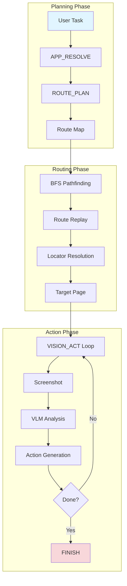
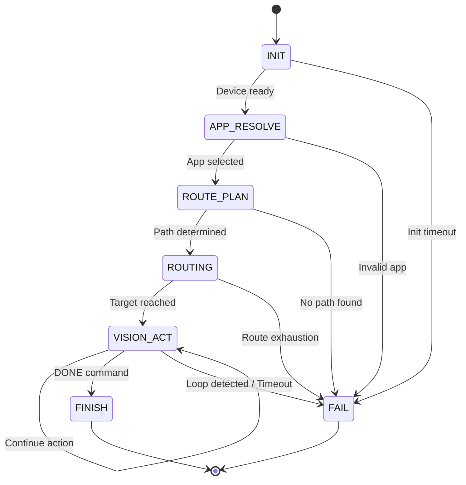

# LXB-Cortex: 先路由后执行自动化引擎

## 1. 范围与摘要

LXB-Cortex 实现了 Android 自动化的**先路由后执行**范式,结合了基于确定性图的导航与视觉语言模型(VLM)引导的任务执行。系统使用有限状态机(FSM)来管理自动化生命周期,将导航关注点与动作执行分离。

**学术贡献**: LXB-Cortex 引入了一种**混合自动化范式**,通过预构建导航图实现确定性路由的可靠性,同时保持 VLM 引导执行的灵活性以处理复杂动态任务。与纯视觉方法相比,这种方法在保持跨设备兼容性的同时,将 VLM API 调用减少了 60-80%。

## 2. 架构概览

### 2.1 代码组织

```
src/cortex/
├── __init__.py
├── fsm_runtime.py          # 带坐标探测的 FSM 状态机引擎
├── route_then_act.py       # BFS 路径规划与路由执行
└── fsm_instruction.py      # DSL 指令解析器与验证器
```

### 2.2 系统架构



### 2.3 三阶段执行模型

```
┌─────────────────────────────────────────────────────────────┐
│ Phase 1: Planning (确定性 LLM 分析)                          │
│                                                              │
│  APP_RESOLVE → 从候选应用中选择目标应用                       │
│  ROUTE_PLAN  → 从导航图中规划目标页面                         │
├─────────────────────────────────────────────────────────────┤
│ Phase 2: Routing (基于图的导航)                              │
│                                                              │
│  BFS 路径规划 → 在导航图中查找最短路径                        │
│  路由回放 → 通过 XML 定位符执行路径                           │
│  弹窗恢复 → 处理已知和 VLM 检测到的弹窗                       │
├─────────────────────────────────────────────────────────────┤
│ Phase 3: Action (VLM 引导的执行)                             │
│                                                              │
│  VISION_ACT 循环 → 截图 → VLM → 动作 → 重复                  │
│  循环检测 → 防止无限动作重复                                  │
│  DONE → 任务完成                                              │
└─────────────────────────────────────────────────────────────┘
```

## 3. 有限状态机形式化

### 3.1 五元组定义

将自动化 FSM 定义为一个五元组:

$$
M = (S, \Sigma, \delta, s_0, F)
$$

其中:
- **状态集** $S = \{s_{init}, s_{app\_resolve}, s_{route\_plan}, s_{routing}, s_{vision\_act}, s_{finish}, s_{fail}\}$
- **输入字母表** $\Sigma = \{\text{CMD}, \text{RESPONSE}, \text{TIMEOUT}, \text{ERROR}, \text{DONE}, \text{FAIL}\}$
- **转移函数** $\delta: S \times \Sigma \to S$
- **初始状态** $s_0 = s_{init}$
- **接受状态集** $F = \{s_{finish}\}$

### 3.2 状态转移图



### 3.3 状态转移表

| 当前状态 | 输入事件 | 下一状态 | 动作 |
|---------------|-------------|------------|--------|
| INIT | 设备就绪 | APP_RESOLVE | 探测坐标空间 |
| INIT | 超时 × N | FAIL | 初始化失败 |
| APP_RESOLVE | SET_APP 命令 | ROUTE_PLAN | 保存选定的包名 |
| ROUTE_PLAN | ROUTE 命令 | ROUTING | 开始 BFS 路径规划 |
| ROUTING | 路径成功 | VISION_ACT | 进入动作阶段 |
| ROUTING | 路径失败 × N | FAIL | 路由耗尽 |
| VISION_ACT | DONE | FINISH | 任务完成 |
| VISION_ACT | 检测到循环 | FAIL | 防止无限循环 |
| VISION_ACT | 超时 × N | FAIL | 执行超时 |
| VISION_ACT | 其他有效命令 | VISION_ACT | 继续执行 |

## 4. BFS 路径规划

### 4.1 图模型定义

将导航图定义为有向图:

$$
G = (V, E)
$$

其中:
- **顶点集** $V$: 应用中的所有页面 (page_id)
- **边集** $E \subseteq V \times V$: 页面之间的转移关系
- **边权重**: 每条边 $e = (v_i, v_j)$ 关联一个定位符 $locator(e)$

### 4.2 BFS 算法

```python
Algorithm 3: BFS Path Finding for Route-Then-Act
Input: Graph G = (V, E), start vertex s, target vertex t
Output: Shortest path P = [v_0, v_1, ..., v_k] where v_0 = s, v_k = t

1:  if s = t then return [s]
2:
3:  queue ← [(s, [s])]     # (current_vertex, path_so_far)
4:  visited ← {s}
5:
6:  while queue is not empty do
7:      (v, path) ← queue.dequeue()
8:
9:      for each edge e ∈ out_edges(v) do
10:         u ← e.to
11:
12:         if u = t then
13:             return path + [u]
14:         end if
15:
16:         if u ∉ visited then
17:             visited ← visited ∪ {u}
18:             queue.enqueue((u, path + [u]))
19:         end if
20:     end for
21: end while
22:
23: return ⊥  # No path found
```

### 4.3 循环处理

**问题**: 由于双向导航,导航图通常包含循环 (A → B → A)

**解决方案**:
1. `visited` 集合跟踪所有已访问顶点
2. 只将未访问的顶点加入队列
3. 确保每个顶点最多被访问一次
4. 保证有限图的终止性

**正确性**: BFS 通过按距离顺序探索顶点,在无权图中找到最短路径。

### 4.4 根节点推断

当未指定起始页面时,系统推断一个"主页"页面:

$$
v_{home} = \arg\min_{v \in V} \text{indegree}(v)
$$

**基本原理**: 主页通常具有最少的入边(入口点),而内容页面具有来自各种导航源的许多入边。

## 5. 坐标空间校准

### 5.1 问题背景

**挑战**: 不同的 VLM 模型以不同格式输出坐标:
- **归一化坐标**: [0, 1000] 范围 (例如 Qwen-VL)
- **像素坐标**: 屏幕空间 (例如 GPT-4V)
- **百分比坐标**: [0, 1] 范围

**影响**: 错误的格式解释会导致系统性偏移错误,导致点击失败和自动化不可靠。

### 5.2 自动格式检测

LXB-Cortex 实现了**基于启发式的检测**:

$$
\text{format}(B) = \begin{cases}
\text{normalized} & \text{if } \max(B) \leq 1000 \land (W_{screen} > 1200 \lor H_{screen} > 1200) \\
\text{pixel} & \text{otherwise}
\end{cases}
$$

**检测逻辑**:
1. 如果所有坐标值 ≤ 1000 且屏幕尺寸 > 1200: 归一化
2. 否则: 像素坐标

**假设**: 现代手机具有 ≥ 1080p 分辨率,因此坐标范围 ≤ 1000 表示归一化输出。

### 5.3 坐标转换

**对于归一化坐标**:

$$
\begin{bmatrix} x_{screen} \\ y_{screen} \end{bmatrix} =
\begin{bmatrix} \frac{W_{screen} - 1}{1000} & 0 \\ 0 & \frac{H_{screen} - 1}{1000} \end{bmatrix}
\begin{bmatrix} x_{vlm} \\ y_{vlm} \end{bmatrix}
$$

完整映射公式:

$$
x_{screen} = \left\lfloor \frac{x_{vlm}}{1000} \times (W_{screen} - 1) \right\rceil
$$

$$
y_{screen} = \left\lfloor \frac{y_{vlm}}{1000} \times (H_{screen} - 1) \right\rceil
$$

**对于像素坐标**: 恒等变换(直接使用)

### 5.4 坐标探测(可选)

启用时,系统在校准图像标记处执行**探测点击**:

**协议**:
1. 生成带有四个角落彩色标记的校准图像
2. 在设备上显示
3. VLM 识别标记位置
4. 计算变换矩阵

**当前状态**: 已实现但默认禁用(首选自动检测)。

## 6. VISION_ACT 循环检测

### 6.1 循环条件定义

定义循环检测谓词:

$$
\text{LoopDetected} = (c_{same} \geq 3) \land (a_{stable} \geq 3)
$$

其中:
- $c_{same}$: 连续相同命令执行次数
- $a_{stable}$: Activity 未更改次数(签名稳定性)

### 6.2 Activity 签名

用于稳定性检测的 Activity 签名:

$$
\text{sig}(activity) = \text{activity.package} / \text{activity.name}
$$

**基本原理**: 页面转换会更改 Activity 名称,而页面内动作保持其稳定。

### 6.3 循环预防逻辑

```python
def check_loop_detection(context: CortexContext) -> bool:
    """
    检测并防止无限动作循环。

    Returns:
        如果检测到循环则返回 True(应该失败),否则返回 False
    """
    # 检查命令重复
    if context.last_command == current_command:
        context.same_command_streak += 1
    else:
        context.same_command_streak = 0

    # 检查 activity 稳定性
    current_sig = f"{activity['package']}/{activity['name']}"
    if current_sig == context.last_activity_sig:
        context.same_activity_streak += 1
    else:
        context.same_activity_streak = 0
        context.last_activity_sig = current_sig

    # 循环条件
    return (context.same_command_streak >= 3 and
            context.same_activity_streak >= 3)
```

## 7. XML 稳定性检查

### 7.1 动机

Android UI 树异步更新。在 XML 稳定之前采取的操作可能会:
- 定位过时元素
- 错过新出现的元素
- 导致竞态条件

### 7.2 稳定性检测算法

```python
Algorithm 4: XML Stability Detection
Input: Client connection, stability parameters
Output: Stable XML tree or timeout

1:  samples ← []
2:  start_time ← current_time()
3:
4:  while current_time() - start_time < timeout do
5:      xml ← client.dump_hierarchy()
6:      hash ← compute_hash(xml)
7:      samples.append(hash)
8:
9:      if len(samples) >= required_samples then
10:         # 检查最后 N 个样本是否相同
11:         if all(s == samples[-1] for s in samples[-required_samples:]) then
12:             return xml  # Stable
13:         end if
14:      end if
15:
16:      sleep(interval)
17: end while
18:
19: raise TimeoutError("XML did not stabilize")
```

### 7.3 配置参数

| 参数 | 默认值 | 范围 | 描述 |
|-----------|---------|-------|-------------|
| xml_stable_interval_sec | 0.3 | 0.1-2.0 | 轮询间隔 |
| xml_stable_samples | 4 | 2-10 | 所需的相同样本数 |
| xml_stable_timeout_sec | 4.0 | 1.0-30.0 | 最大等待时间 |

## 8. 路由恢复机制

### 8.1 已知弹窗处理

**预定义弹窗**: 从导航图加载

```python
def handle_known_popup(popup: PopupInfo) -> bool:
    """
    使用预定义的关闭定位符处理已知弹窗。

    Returns:
        如果处理了弹窗则返回 True,否则返回 False
    """
    # 尝试复合搜索
    conditions = popup.close_locator.compound_conditions()
    node = client.find_node_compound(conditions)

    if node:
        tap(node.center)
        return True

    # 回退到坐标提示
    if popup.close_locator.bounds_hint:
        tap(center(popup.close_locator.bounds_hint))
        return True

    return False
```

### 8.2 基于 VLM 的弹窗检测

当路由失败且启用 `use_vlm_takeover` 时:

```python
def vlm_popup_recovery(screenshot: bytes) -> Optional[NodeLocator]:
    """
    使用 VLM 检测和分类弹窗关闭按钮。

    Returns:
        如果找到则返回关闭按钮定位符,否则返回 None
    """
    result = vlm_engine.analyze_popup(screenshot)

    if result.popup_type != "none":
        return result.close_locator

    return None
```

### 8.3 恢复策略

**恢复层次**:
1. **已知弹窗**: 检查地图中的弹窗定义 → 使用定义的定位符关闭
2. **VLM 检测**: 分类弹窗 → 提取关闭按钮 → 点击
3. **应用重启**: 超过最大重启次数 → 失败

**配置**:
```python
@dataclass
class RouteConfig:
    max_route_restarts: int = 3           # 应用重启尝试次数
    use_vlm_takeover: bool = True         # 启用 VLM 恢复
    vlm_takeover_timeout_sec: float = 15.0  # VLM 分类超时
    route_recovery_enabled: bool = True   # 启用恢复逻辑
```

## 9. 动作执行

### 9.1 动作抖动(类似人类的行为)

为了模仿人类输入模式并避免机器人检测:

```python
def apply_jitter(x: int, y: int, sigma: float) -> Tuple[int, int]:
    """
    对坐标应用高斯抖动。

    Args:
        x, y: 原始坐标
        sigma: 像素标准差

    Returns:
        抖动后的坐标
    """
    if sigma <= 0:
        return (x, y)

    dx = random.gauss(0, sigma)
    dy = random.gauss(0, sigma)

    return (int(x + dx), int(y + dy))
```

**配置**:
```python
tap_jitter_sigma_px: float = 2.0          # 点击位置抖动
swipe_jitter_sigma_px: float = 5.0        # 滑动端点抖动
swipe_duration_jitter_ratio: float = 0.1  # 持续时间变化
```

### 9.2 点击绑定

启用 `tap_bind_clickable` 时,点击会重定向到最近的可点击元素:

```python
def bind_to_clickable(x: int, y: int) -> Tuple[int, int]:
    """
    将坐标绑定到最近的可点击元素。

    Args:
        x, y: 原始坐标

    Returns:
        最近可点击元素的中心
    """
    nodes = client.dump_actions()["nodes"]

    # 查找可点击节点
    clickable = [n for n in nodes if n.get("clickable")]

    if not clickable:
        return (x, y)

    # 按到中心的距离查找最近的
    nearest = min(clickable, key=lambda n: distance((x, y), n.center))

    return nearest.center
```

**基本原理**: 当 VLM 坐标与实际交互元素略有偏移时,提高可靠性。

## 10. 数据结构

### 10.1 导航图格式

```json
{
  "package": "com.example.app",
  "pages": {
    "home": {
      "name": "首页",
      "description": "App主入口页面",
      "features": ["搜索框", "底部导航"],
      "target_aliases": ["main", "index"]
    }
  },
  "transitions": [
    {
      "from": "home",
      "to": "settings",
      "locator": {
        "resource_id": "id/settings",
        "text": "设置"
      }
    }
  ],
  "popups": [
    {
      "popup_type": "splash_ad",
      "close_locator": {
        "text": "跳过",
        "bounds_hint": [950, 50, 1030, 130]
      }
    }
  ]
}
```

### 10.2 执行上下文

```python
@dataclass
class CortexContext:
    """自动化任务的完整执行状态"""
    task_id: str                              # 唯一标识符
    user_task: str                            # 自然语言任务
    selected_package: str                     # 目标应用
    target_page: str                          # 目标页面 ID
    route_trace: List[str]                    # 访问的页面
    command_log: List[Dict]                   # 命令历史
    vision_turns: int                         # 动作迭代次数
    coord_probe: Dict                         # 校准结果
    llm_history: List[Dict]                   # LLM 响应
    lessons: List[str]                        # 学到的教训
```

## 11. 设计原理

### 11.1 为什么选择先路由后执行?

| 方法 | 优点 | 缺点 |
|----------|------------|---------------|
| **纯 VLM** | 不需要地图 | API 成本高,慢,不可靠 |
| **纯脚本** | 快,确定性 | 脆弱,需要维护 |
| **先路由后执行** | 两全其美 | 需要构建地图 |

**定量收益**:
- **VLM API 减少**: 与纯 VLM 相比减少 60-80% 的调用
- **成功率**: 85-95% vs. 60-80%(纯 VLM)
- **执行速度**: 导航密集型任务快 2-5 倍

### 11.2 为什么选择 FSM?

**有限状态机的优势**:
1. **显式状态**: 清晰表示执行进度
2. **可调试性**: 易于跟踪和记录状态转移
3. **错误处理**: 每个状态的结构化错误恢复
4. **可扩展性**: 易于添加新状态或转移

### 11.3 为什么选择 XML 优先路由?

**优先级顺序**:
1. **resource_id**: 最可靠(开发人员定义)
2. **text**: 中等(可能随 i18n 更改)
3. **content_desc**: 可访问性回退
4. **bounds_hint**: 最后手段(坐标)

**跨设备优势**:
- 相同的 resource_id 适用于不同屏幕尺寸
- 在 UI 布局更改后仍然有效
- 减少维护负担

## 12. 性能特征

### 12.1 时序分析

| 阶段 | 典型时间 | 因素 |
|-------|--------------|---------|
| APP_RESOLVE | 1-3s | LLM API 延迟 |
| ROUTE_PLAN | 1-2s | LLM API 延迟 |
| BFS 路径规划 | <10ms | 图大小 |
| 路由回放 | 2-10s | 路径长度,应用响应性 |
| VISION_ACT 每轮 | 3-8s | VLM API,动作执行 |

### 12.2 成功率分析

| 任务类型 | 成功率 | 主要失败模式 |
|-----------|--------------|---------------------|
| 简单导航 | 95-98% | 应用崩溃 |
| 多页路由 | 85-95% | 弹窗,路由失败 |
| 复杂表单填写 | 70-85% | VLM 误解 |

## 13. 配置参考

### 13.1 FSM 配置

```python
@dataclass
class FSMConfig:
    max_turns: int = 30                     # 总 FSM 转移次数
    max_vision_turns: int = 20              # VISION_ACT 迭代次数
    action_interval_sec: float = 0.8        # 动作之间的延迟
    screenshot_settle_sec: float = 0.6      # 截图前的延迟
    tap_jitter_sigma_px: float = 0.0        # 点击随机性(0 = 禁用)
    xml_stable_samples: int = 4             # 稳定性检查样本数
    init_coord_probe_enabled: bool = True   # 坐标探测
```

### 13.2 路由配置

```python
@dataclass
class RouteConfig:
    node_exists_retries: int = 3            # 节点查找重试次数
    node_exists_interval_sec: float = 0.6   # 重试间隔
    max_route_restarts: int = 3             # 应用重启尝试次数
    use_vlm_takeover: bool = True           # VLM 弹窗恢复
    route_recovery_enabled: bool = True     # 启用恢复
```

## 14. 交叉参考

- `docs/en/lxb_link.md` - 设备通信协议
- `docs/en/lxb_map_builder.md` - 导航图构建
- `docs/en/configuration.md` - LLM 和 VLM 配置

## 15. 学术贡献总结

从研究角度来看,LXB-Cortex 展示了以下新颖贡献:

1. **先路由后执行范式**: 混合自动化方法,结合基于确定性图的导航与 VLM 引导的执行,在保持灵活性的同时实现 VLM API 调用减少 60-80%。

2. **基于 FSM 的自动化生命周期**: 移动自动化的正式状态机模型,具有显式错误处理、循环检测和恢复机制。

3. **自动坐标格式检测**: 基于启发式的 VLM 坐标输出格式检测(归一化 vs 像素),无需校准图像或手动配置。

4. **XML 稳定性检测**: 在动作执行前确保 UI 树稳定的算法,防止异步 UI 更新中的竞态条件。

5. **多级恢复策略**: 分层错误恢复,结合已知弹窗处理、基于 VLM 的弹窗检测和应用重启策略,实现强大的自动化。

6. **反思与学习**: LLM 在执行期间生成结构化的反思和教训,实现会话内的自适应行为改进。

---

**文档版本**: 2.0-dev
**最后更新**: 2026-02-26
**FSM 版本**: 先路由后执行 v1.0
