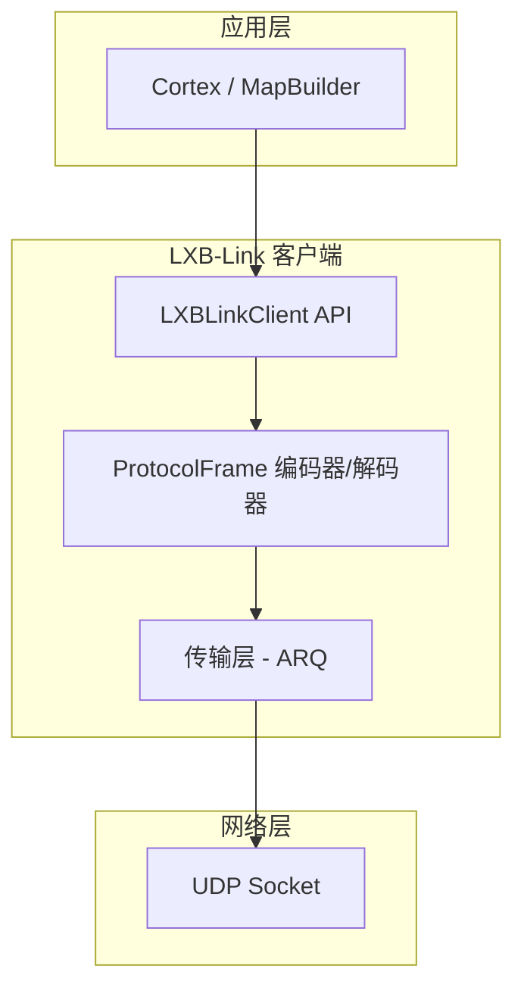
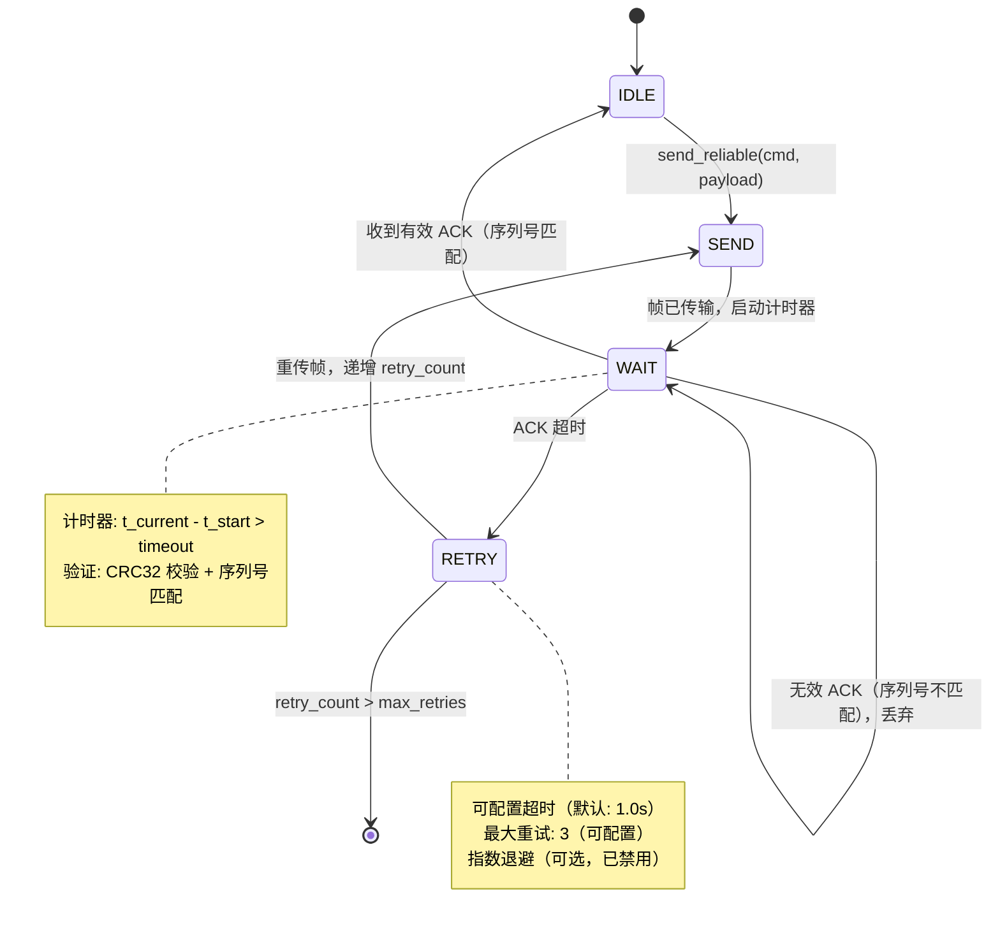
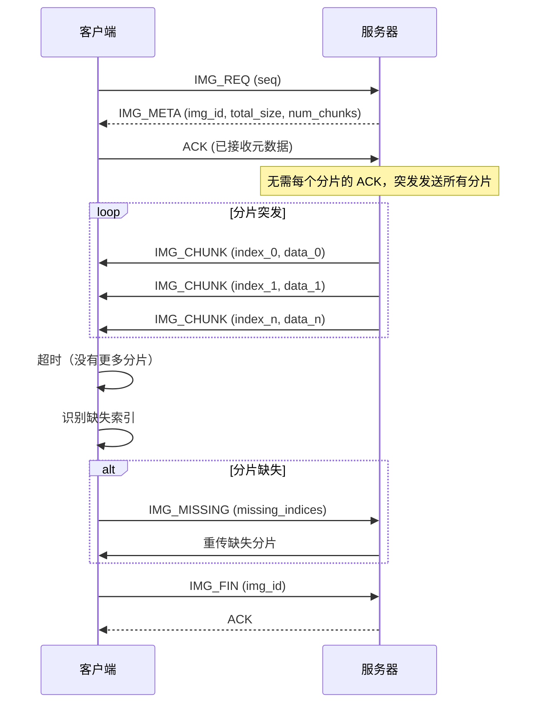

# LXB-Link：可靠的 UDP 传输协议

## 1. 范围与摘要

LXB-Link 是 PC 端传输协议层，为 Android 设备通信提供可靠的命令交付和响应接收。该协议在 UDP 上实现自定义二进制协议，通过应用层的停止等待 ARQ（自动重传请求）提供可靠性保证，实现低延迟、NAT 穿透友好的移动设备自动化任务通信。

**学术贡献**：LXB-Link 证明了应用层 ARQ over UDP 可以提供与 TCP 相当的可靠性，同时为移动设备自动化场景提供更优的性能，特别是在移动设备测试基础设施典型的 NAT 穿透环境中。

## 2. 架构概述

### 2.1 代码组织

```
src/lxb_link/
├── __init__.py
├── client.py               # 主客户端 API - 统一命令接口
├── transport.py            # 可靠 UDP 传输 - 停止等待 ARQ
├── protocol.py             # 二进制帧编码/解码，带 CRC32
└── constants.py            # 命令定义和协议常量
```

### 2.2 分层架构



### 2.3 协议栈

```
┌─────────────────────────────────────────────────────────────┐
│ 应用层 (Cortex, MapBuilder, WebConsole)                      │
├─────────────────────────────────────────────────────────────┤
│ LXBLinkClient (统一 API)                                     │
│ - tap(), swipe(), input_text(), find_node() 等              │
├─────────────────────────────────────────────────────────────┤
│ ProtocolFrame 层（二进制编码）                                │
│ - pack/unpack 带 CRC32 校验                                 │
│ - 字符串池优化带宽效率                                        │
├─────────────────────────────────────────────────────────────┤
│ 传输层（停止等待 ARQ）                                        │
│ - send_reliable(): 带重试的可靠交付                          │
│ - send_and_forget(): 尽力交付                                │
│ - 大数据的分片传输                                            │
├─────────────────────────────────────────────────────────────┤
│ UDP Socket（网络层）                                          │
└─────────────────────────────────────────────────────────────┘
```

## 3. 协议帧规范

### 3.1 字节级帧结构

LXB-Link 协议使用紧凑的二进制帧格式，针对解析效率和带宽利用率进行了优化：

```
┌─────────┬─────────┬─────────┬─────────┬─────────┬─────────┬─────────┐
│ Magic   │ Version │ Sequence│ Command │ Length  │ Payload │ CRC32   │
│ 2 bytes │ 1 byte  │ 4 bytes │ 1 byte  │ 2 bytes │ N bytes │ 4 bytes │
│ 0xAA55  │ 0x01    │ uint32  │ uint8   │ uint16  │ variable│ uint32  │
└─────────┴─────────┴─────────┴─────────┴─────────┴─────────┴─────────┘

帧总长度: 14 + N 字节（不包括 UDP/IP 头）
```

### 3.2 字段规范表

| 偏移 | 字段 | 大小 | 类型 | 范围 | 描述 |
|------|------|------|------|------|------|
| 0 | Magic | 2B | uint16 | 0xAA55 | 协议魔数，用于帧同步和验证 |
| 2 | Version | 1B | uint8 | 0x01 | 协议版本标识符（当前 v1.0-dev） |
| 3 | Seq | 4B | uint32 | 0 - 2³²-1 | 单调递增的序列号（在 2³² 处回绕） |
| 7 | Cmd | 1B | uint8 | 0x00-0xFF | 命令标识符（见第 6 节：命令分类） |
| 8 | Len | 2B | uint16 | 0-65521 | 负载长度（字节）MAX_PAYLOAD_SIZE = 65521 |
| 10 | Data | NB | bytes | variable | 命令特定的负载数据 |
| 10+N | CRC32 | 4B | uint32 | 0-2³²-1 | 头部 + 负载的 CRC32 校验和 |

### 3.3 CRC32 校验和计算

**数学定义**：

$$
\text{CRC32} = \text{CRC32}(\text{Magic} \| \text{Version} \| \text{Seq} \| \text{Cmd} \| \text{Len} \| \text{Data}) \pmod{2^{32}}
$$

**实现**（使用 Python 的 zlib）：

```python
import zlib

def calculate_crc32(frame_without_crc: bytes) -> int:
    """
    计算用于帧验证的 CRC32 校验和。

    Args:
        frame_without_crc: 头部（10 字节）+ 负载（N 字节）

    Returns:
        CRC32 校验和（无符号 32 位整数）
    """
    return zlib.crc32(frame_without_crc) & 0xFFFFFFFF
```

### 3.4 字节序与编码

所有多字节字段使用**网络字节序（大端序）**，符合 IETF RFC 791 规范：

```python
# 头部编码的 Python struct 格式字符串
HEADER_FORMAT = '>HBIBH'  # '>' = 大端序网络字节序
# H: uint16 (Magic)
# B: uint8  (Version)
# I: uint32 (Sequence)
# B: uint8  (Command)
# H: uint16 (Length)
```

**设计理由**：大端编码确保协议在不同 CPU 架构（x86、ARM、MIPS）之间的兼容性，并与标准网络协议约定保持一致。

### 3.5 字符串池优化（Binary First 架构）

为了最小化 UI 树传输的带宽消耗，LXB-Link 实现了字符串常量池，对重复的类名和文本实现约 96% 的压缩。

**字符串池结构**：

| ID 范围 | 类型 | 示例 |
|---------|------|------|
| 0x00-0x3F | 预定义类（64 个） | android.widget.Button, android.view.ViewGroup |
| 0x40-0x7F | 预定义文本（64 个） | "确认"、"Cancel"、"OK"、"Settings" |
| 0x80-0xFE | 动态字符串 | 运行时检测到的字符串 |
| 0xFF | 空/Null | 缺失字符串的特殊标记 |

**带宽节省分析**：

不使用字符串池："android.widget.Button" = 24 字节/节点
使用字符串池：0x04（1 字节）+ 引用计数开销
**节省**：常见类名约 96%

## 4. 停止等待 ARQ 协议

### 4.1 形式化协议定义

将可靠传输协议定义为 4 元组：

$$
\mathcal{P} = (S, \mathcal{T}, \mathcal{R}, \delta)
$$

其中：
- **状态集** $S = \{s_{idle}, s_{send}, s_{wait}, s_{retry}\}$
- **超时计时器** $\mathcal{T} = (t_{start}, t_{timeout})$ 其中 $t_{timeout} \in \mathbb{R}^+$
- **重传计数器** $\mathcal{R} = (r_{current}, r_{max})$ 其中 $r_{max} = 3$（默认）
- **转移函数** $\delta: S \times \Sigma \to S$

### 4.2 状态机图



### 4.3 超时与重传逻辑

**配置参数**：

| 参数 | 默认值 | 范围 | 描述 |
|------|--------|------|------|
| timeout | 1.0s | 0.1-10.0s | 每次尝试的套接字接收超时 |
| max_retries | 3 | 1-10 | 最大重传尝试次数 |

**伪代码**：

```python
def send_reliable(cmd: int, payload: bytes) -> bytes:
    """
    使用停止等待 ARQ 保证发送命令。

    Returns:
        来自服务器的响应负载

    Raises:
        LXBTimeoutError: 如果超过最大重试次数仍未收到有效 ACK
    """
    seq = next_sequence_number()
    frame = pack_frame(seq, cmd, payload)
    retry_count = 0

    while retry_count <= max_retries:
        # 状态: SEND
        send_frame(frame)
        send_time = current_time()

        # 状态: WAIT
        while True:
            try:
                recv_data = receive_frame(timeout=timeout)
                recv_seq, recv_cmd, recv_payload = unpack_frame(recv_data)

                # 验证响应
                if recv_cmd == CMD_ACK and recv_seq == seq:
                    # 成功: 有效 ACK
                    rtt = current_time() - send_time
                    log(f"收到 ACK: RTT={rtt*1000:.1f}ms")
                    return recv_payload
                else:
                    # 无效帧 - 继续等待
                    log(f"意外帧: cmd=0x{recv_cmd:02X}, seq={recv_seq}")
                    continue

            except ChecksumError:
                # CRC32 不匹配 - 丢弃并继续
                continue

            except Timeout:
                # 超时 - 退出到重传逻辑
                log(f"超时: retry={retry_count}/{max_retries}")
                break

        # 状态: RETRY
        retry_count += 1

        if retry_count > max_retries:
            raise LXBTimeoutError(f"超过最大重试次数 ({max_retries})")

    # 不应到达此处
    raise LXBTimeoutError("传输失败")
```

### 4.4 序列号管理

**序列号属性**：

- **类型**：32 位无符号整数（uint32）
- **范围**：$[0, 2^{32}-1]$
- **回绕**：在 $2^{32}$ 处自动回绕（使用模运算）

**生成逻辑**：

```python
def _next_seq(self) -> int:
    """
    获取下一个序列号并自动递增。

    Returns:
        当前序列号（下次调用时自动递增）
    """
    current_seq = self._seq
    self._seq = (self._seq + 1) & 0xFFFFFFFF  # 模 2^32
    return current_seq
```

**冲突避免**：使用 32 位序列空间和典型命令率（<1000 cmd/s），约每 49 天回绕一次。协议要求在超时窗口内处理 ACK，避免歧义。

## 5. 分片数据传输协议

### 5.1 协议概述

对于大数据传输（截图、UI 树），LXB-Link 在 UDP 上实现**选择性重传**协议，使用服务器拉取模型，支持突发传输和选择性重传。

**为什么不使用 TCP？**
- TCP 的拥塞控制为小数据传输增加延迟
- UDP 允许为移动网络定制的重传策略
- UDP 在 NAT 穿透方面性能更优

### 5.2 分片传输状态机



### 5.3 消息规范

#### IMG_REQ (0x61) - 请求截图

**方向**：客户端 → 服务器

**负载**：空（0 字节）

**目的**：启动截图传输序列

#### IMG_META (0x62) - 图像元数据

**方向**：服务器 → 客户端

**负载结构**：

```python
def pack_img_meta(img_id: int, total_size: int, num_chunks: int) -> bytes:
    """
    打包图像元数据响应。

    Args:
        img_id: 唯一图像标识符（uint32）
        total_size: 图像总大小（字节）（uint32）
        num_chunks: 分片数量（uint16）
    """
    return struct.pack('>IIH', img_id, total_size, num_chunks)
```

#### IMG_CHUNK (0x63) - 图像分片

**方向**：服务器 → 客户端

**负载结构**：

```python
def pack_img_chunk(chunk_index: int, chunk_data: bytes) -> bytes:
    """
    打包单个分片。

    Args:
        chunk_index: 分片索引（uint16）
        chunk_data: 分片负载（可变，最大 CHUNK_SIZE）
    """
    header = struct.pack('>H', chunk_index)
    return header + chunk_data
```

**突发模式**：服务器传输所有分片而不等待每个分片的 ACK，利用 UDP 的自然数据包缓冲。

#### IMG_MISSING (0x64) - 请求缺失分片

**方向**：客户端 → 服务器

**负载结构**：

```python
def pack_img_missing(seq: int, missing_indices: list[int], img_id: int) -> bytes:
    """
    打包缺失分片的请求。

    Args:
        missing_indices: 缺失分片的索引列表
        img_id: 用于验证的图像标识符
    """
    count = len(missing_indices)
    indices = struct.pack(f'>{count}H', *missing_indices)
    img_id_bytes = struct.pack('>I', img_id)
    return img_id_bytes + indices
```

#### IMG_FIN (0x65) - 传输完成

**方向**：客户端 → 服务器

**目的**：信号传输完成，允许服务器释放缓冲区

**可靠性**：使用 send_reliable() 确保交付

### 5.4 配置参数

| 参数 | 默认值 | 范围 | 描述 |
|------|--------|------|------|
| CHUNK_SIZE | 1024 字节 | 512-8192 | 每个分片的大小 |
| CHUNK_RECV_TIMEOUT | 0.3s | 0.1-2.0s | 分片突发接收的超时时间 |
| MAX_MISSING_RETRIES | 3 | 1-10 | 最大选择性重传尝试次数 |

### 5.5 性能特征

**典型值**（1080×2400 截图，JPEG 质量 85）：

| 指标 | 数值 |
|------|------|
| 图像大小 | 100-500 KB |
| 分片数量 | 100-500 |
| 完整传输时间 | 200-500 ms（局域网） |
| 重传率 | 1-5%（典型 WiFi） |
| 带宽使用 | 2-5 MB/s（峰值） |

## 6. 命令分类

LXB-Link 实现了按功能域组织的**分层 ISA**（指令集架构）命令集：

### 6.1 命令分配表

| 范围 | 层 | 命令 | 目的 |
|------|-----|------|------|
| 0x00-0x0F | 链路层 | HANDSHAKE、ACK、HEARTBEAT、NOOP | 协议基础设施 |
| 0x10-0x1F | 输入层 | TAP、SWIPE、LONG_PRESS、MULTI_TOUCH、GESTURE | 基本用户交互 |
| 0x20-0x2F | 输入扩展 | INPUT_TEXT、KEY_EVENT、PASTE | 高级输入方法 |
| 0x30-0x3F | 感知层 | GET_ACTIVITY、DUMP_HIERARCHY、FIND_NODE | UI 感知 |
| 0x40-0x4F | 生命周期 | LAUNCH_APP、STOP_APP、LIST_APPS、CLIPBOARD | 应用管理 |
| 0x50-0x5F | 调试层 | GET_DEVICE_INFO、LOGCAT、PERF_STATS | 诊断 |
| 0x60-0x6F | 媒体层 | SCREENSHOT、IMG_REQ/IMG_META/IMG_CHUNK、SCREEN_RECORD | 媒体捕获 |
| 0x70-0xEF | 保留 | - | 未来扩展 |
| 0xF0-0xFF | 厂商 | - | 自定义扩展 |

### 6.2 命令矩阵

| 命令 | 十六进制 | 方向 | 负载 | 响应 | 可靠性 |
|------|----------|------|------|------|--------|
| HANDSHAKE | 0x01 | C→S | protocol_version | server_info | 可靠 |
| ACK | 0x02 | S→C | response_payload | - | 不适用 |
| HEARTBEAT | 0x03 | C↔S | timestamp | timestamp | 可靠 |
| TAP | 0x10 | C→S | x, y | success | 可靠 |
| SWIPE | 0x11 | C→S | x1, y1, x2, y2, duration | success | 可靠 |
| INPUT_TEXT | 0x20 | C→S | text (UTF-8), flags | success | 可靠 |
| GET_ACTIVITY | 0x30 | C→S | - | activity_name | 可靠 |
| DUMP_HIERARCHY | 0x31 | C→S | format, max_depth | ui_tree | 可靠 |
| FIND_NODE | 0x32 | C→S | field, operator, value | node_info | 可靠 |
| FIND_NODE_COMPOUND | 0x39 | C→S | conditions[] | node_info | 可靠 |
| SCREENSHOT | 0x60 | C→S | quality | image_data | 分片传输 |

## 7. 设计原理

### 7.1 为什么选择 UDP 而不是 TCP？

**对比分析**：

| 属性 | TCP | UDP | LXB-Link 选择 |
|------|-----|-----|-------------|
| 连接建立 | 3 次握手（2×RTT） | 无 | UDP 降低延迟 |
| 首包延迟 | 2×RTT | RTT | UDP 更快 |
| 拥塞控制 | 内置（可能保守） | 应用控制 | 自定义调优 |
| 队头阻塞 | 是 | 否 | UDP 允许并行 |
| NAT 穿透 | 中等（SYN 过滤） | **优** | UDP 打洞 |
| 头部开销 | 20 字节 | 8 字节 | UDP 少 60% |

**学术表述**：

> LXB-Link 选择 UDP 作为传输层以在移动设备自动化场景中实现最佳延迟。应用层实现的停止等待 ARQ 提供与 TCP 相当的可靠性保证，同时提供对超时和重传行为的更优控制。这种设计选择在移动测试基础设施典型的 NAT 穿透部署中特别有利，UDP 的无连接特性促进了更健壮的打洞技术。

### 7.2 检索优先定位策略

**理念**：优先考虑语义元素识别而非基于坐标的交互。

**优先级顺序**：
1. **resource_id**：最可靠（开发者定义，稳定）
2. **text**：中等可靠性（UI 文本，可能随国际化变化）
3. **content_description**：回退方案（无障碍标签）
4. **bounds_hint**：最后手段（基于坐标）

**理由**：基于坐标的 UI 自动化在以下情况下很脆弱：
- 不同的屏幕分辨率
- 不同的设备密度
- 动态内容布局
- UI 重新设计

基于检索的定位器提供：
- **跨设备兼容性**：相同的 resource_id 适用于所有设备
- **布局独立性**：适用于动态内容重排
- **维护效率**：在轻微 UI 更改后仍能正常工作

### 7.3 二进制优先架构

**设计原则**：拒绝 JSON 膨胀，使用紧凑的二进制编码。

**带宽对比**（1000 个节点的典型 UI 树）：

| 格式 | 大小 | 比率 |
|------|------|------|
| JSON（详细） | ~500 KB | 1.0×（基准） |
| JSON（压缩） | ~300 KB | 0.6× |
| 二进制（朴素） | ~150 KB | 0.3× |
| **二进制 + 字符串池** | **~20 KB** | **0.04×** |

**实现**：
- 定宽整数字段（无解析开销）
- 字符串常量池（常见字符串压缩 96%）
- 位域标志（8 个布尔属性占 1 字节）
- 坐标增量编码（未来增强）

## 8. 错误处理

### 8.1 错误码

| 代码 | 名称 | 描述 |
|------|------|------|
| 0x00 | ERR_SUCCESS | 操作成功完成 |
| 0x01 | ERR_INVALID_MAGIC | 魔数不匹配（帧损坏） |
| 0x02 | ERR_INVALID_VERSION | 不支持的协议版本 |
| 0x03 | ERR_INVALID_CRC | CRC32 校验和验证失败 |
| 0x04 | ERR_INVALID_PAYLOAD_SIZE | 负载超过 MAX_PAYLOAD_SIZE |
| 0x05 | ERR_TIMEOUT | 操作超时 |
| 0x06 | ERR_MAX_RETRIES | 超过最大重试次数 |
| 0x07 | ERR_INVALID_ACK | 收到无效确认 |
| 0x08 | ERR_SEQ_MISMATCH | 序列号不匹配 |
| 0x09 | ERR_NOT_FOUND | 请求的元素未找到 |
| 0x0A | ERR_INVALID_PARAM | 提供的参数无效 |
| 0x0B | ERR_UNSUPPORTED | 不支持的操作 |

### 8.2 异常层次结构

```python
LXBLinkError (基类)
├── LXBTimeoutError
│   └── 超过 max_retries 时引发
├── LXBProtocolError
│   ├── ERR_INVALID_MAGIC
│   ├── ERR_INVALID_VERSION
│   └── ERR_INVALID_ACK
└── LXBChecksumError
    └── ERR_INVALID_CRC
```

### 8.3 故障恢复策略

**校验和失败**：

```python
try:
    recv_seq, recv_cmd, recv_payload = ProtocolFrame.unpack(data)
except LXBChecksumError:
    # 丢弃损坏的帧，继续等待
    logger.warning("CRC32 不匹配，丢弃帧")
    continue
```

**超过最大重试**：

```python
if retry_count > max_retries:
    raise LXBTimeoutError(
        f"在 {max_retries} 次重试后失败。"
        f"可能原因：网络拥塞、服务器过载、"
        f"NAT 超时或设备断开连接。"
    )
```

## 9. 性能优化

### 9.1 套接字缓冲区配置

```python
SOCKET_BUFFER_SIZE = 65536  # 64 KB 接收缓冲区
```

**理由**：更大的缓冲区减少突发传输期间的丢包（分片截图传输）。

### 9.2 接收缓冲区排空

**问题**：来自中断会话的陈旧帧可能会在 UDP 接收缓冲区中累积。

**解决方案**：在启动新会话前进行防御性缓冲区排空：

```python
def _drain_receive_buffer(self, timeout: float = 0.01, max_frames: int = 1024) -> int:
    """
    排空 UDP 接收缓冲区中的陈旧帧。

    Returns:
        排空的帧数
    """
    # 临时设置短超时
    original_timeout = self._sock.gettimeout()
    self._sock.settimeout(timeout)

    drained = 0
    try:
        while drained < max_frames:
            self._sock.recvfrom(SOCKET_BUFFER_SIZE)
            drained += 1
    except socket.timeout:
        pass  # 预期行为
    finally:
        self._sock.settimeout(original_timeout)

    return drained
```

### 9.3 指数退避（可选）

**当前状态**：已禁用（代码中注释掉）

**未来增强**：

```python
# 重传的指数退避
backoff = min(timeout * (2 ** (retry_count - 1)), 5.0)
time.sleep(backoff)
```

**权衡**：减少网络拥塞 vs. 增加总延迟。

## 10. 代码结构

| 文件 | 行数 | 职责 | 关键类/函数 |
|------|------|------|-----------|
| `client.py` | ~300 | 统一 API 门面 | `LXBLinkClient` |
| `transport.py` | ~700 | ARQ 实现 | `Transport.send_reliable()`, `Transport.request_screenshot_fragmented()` |
| `protocol.py` | ~500 | 二进制编码 | `ProtocolFrame.pack()`, `ProtocolFrame.unpack()` |
| `constants.py` | ~600 | 协议定义 | 命令码、错误码、字符串池 |

## 11. 交叉引用

- `docs/zh/lxb_server.md` - Android 端协议服务器实现
- `docs/zh/lxb_cortex.md` - 使用 LXB-Link 的 Cortex 自动化引擎
- `docs/zh/lxb_map_builder.md` - 使用 LXB-Link 感知命令的地图构建器
- `docs/zh/lxb_web_console.md` - 带有分片截图传输的 Web 控制台

## 12. 学术贡献总结

从研究角度来看，LXB-Link 展示了以下新颖贡献：

1. **UDP 应用层 ARQ**：证明了应用层实现的停止等待 ARQ 可以提供与 TCP 相当的可靠性，同时为移动自动化工作负载提供更优的延迟控制。

2. **大数据传输的选择性重传**：使用突发模式传输和选择性重传实现截图和 UI 树的高效分片传输协议，在局域网上实现 2-5 FPS 性能。

3. **字符串池压缩**：通过二进制优先架构和字符串常量池实现 UI 树传输的 96% 带宽减少，实现实时 UI 状态同步。

4. **NAT 穿透优化**：与 TCP 相比，UDP 传输促进了更优的 NAT 穿透性能，能够通过隧道服务（frp、ngrok、cpolar）实现远程设备访问，无需复杂的端口转发配置。

5. **检索优先定位**：将语义元素识别（resource_id、text）作为主要定位策略，坐标作为回退方案，提高跨设备兼容性并减少维护负担。

---

**文档版本**：2.0-dev
**最后更新**：2026-02-26
**协议版本**：1.0-dev（二进制优先架构）
