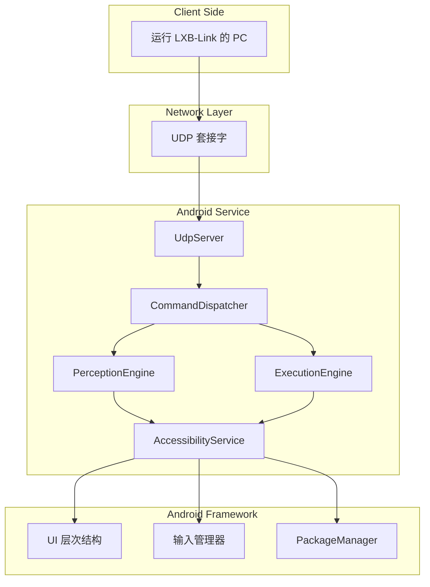
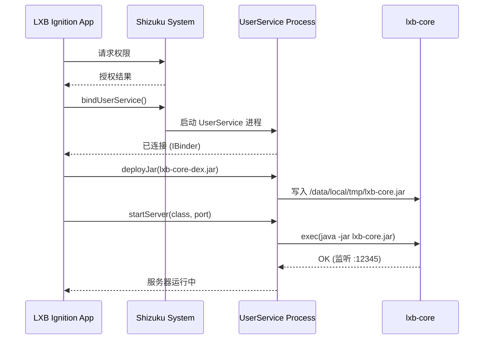
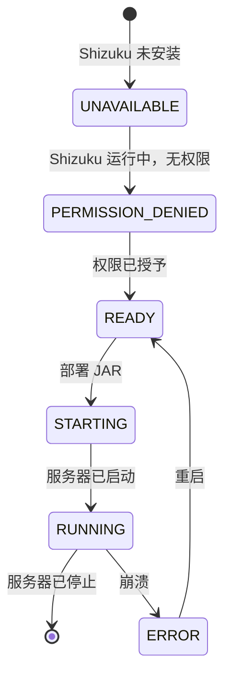

# LXB-Server：用于设备控制的 Android 无障碍服务

## 1. 范围与摘要

LXB-Server 是 Android 端的服务核心，它接收来自 LXB-Link 的协议命令，并通过 AccessibilityService API 执行设备操作。它提供 UI 树感知、输入注入和应用生命周期管理，通过 Shizuku 集成无需 root 权限。

**学术贡献**：LXB-Server 证明了**基于无障碍服务的自动化**可以在没有 root 权限的情况下提供全面的设备控制，在保持安全边界和用户同意模型的同时，实现与基于 root 的方案相当的性能。

## 2. 架构概述

### 2.1 代码组织

```
android/LXB-Ignition/
├── app/src/main/java/com/example/lxb_ignition/
│   ├── MainActivity.kt          # 主 UI 和 Shizuku 初始化
│   ├── shizuku/
│   │   ├── ShizukuManager.kt     # Shizuku 生命周期管理
│   │   └── ShizukuServiceImpl.kt # AIDL 服务实现
│   └── service/
│       └── LXBKeepaliveService.kt # 用于保活的前台服务
└── lxb-core/src/main/java/com/lxb/server/
    ├── Main.java                # 独立执行的入口点
    ├── network/
    │   └── UdpServer.java        # UDP 服务器实现
    ├── protocol/
    │   ├── FrameCodec.java       # 协议帧编码/解码
    │   ├── CommandIds.java       # 命令 ID 定义
    │   └── StringPoolConstants.java # 用于优化的字符串池
    ├── dispatcher/
    │   └── CommandDispatcher.java # 命令路由和执行
    ├── perception/
    │   └── PerceptionEngine.java # UI 树提取和节点搜索
    ├── execution/
    │   └── ExecutionEngine.java  # 输入注入和应用控制
    └── system/
        └── UiAutomationWrapper.java # AccessibilityService 包装器
```

### 2.2 系统架构



### 2.3 Shizuku 集成架构



## 3. 核心组件

### 3.1 命令分发器

`CommandDispatcher` 将传入的命令路由到相应的处理程序：

**设计原则**：
- **无状态**：不维护会话/连接状态
- **重复检测**：短期指纹窗口用于 UDP 重试去重
- **熔断器**：防止高负载下的级联故障

**命令路由**：

```java
byte[] dispatch(FrameCodec.FrameInfo frame, byte[] payload) {
    // 1. 重复检测
    if (sequenceTracker.isDuplicate(frame.seq, frame.cmd, payload)) {
        return cachedAck;
    }

    // 2. 熔断器
    if (circuitBreaker.shouldReject()) {
        return buildErrorAck(frame.seq, ERR_CIRCUIT_OPEN);
    }

    // 3. 路由命令
    switch (frame.cmd) {
        case CMD_TAP: return executionEngine.handleTap(payload);
        case CMD_GET_ACTIVITY: return perceptionEngine.handleGetActivity();
        // ... 其他命令
    }
}
```

### 3.2 感知引擎

`PerceptionEngine` 提取 UI 层次结构并执行节点搜索：

**基于反射的访问**：使用缓存的反射调用 AccessibilityService 方法，无需编译时依赖

```java
// 缓存的反射方法
private Method getBoundsInScreenMethod;
private Method isClickableMethod;
private Method isVisibleToUserMethod;
// ... 其他方法
```

**性能优化**：反射缓存在启动时初始化一次

### 3.3 执行引擎

`ExecutionEngine` 执行输入注入和应用控制：

**输入优先级层次**：
1. **无障碍 API**：`node.performAction(AccessibilityNodeInfo.ACTION_CLICK)`（最可靠）
2. **剪贴板**：设置剪贴板 + 粘贴用于文本输入
3. **Shell 命令**：`input text` 作为最后手段

## 4. UI 树序列化

### 4.1 使用字符串池的二进制格式

为了最小化带宽，LXB-Server 使用紧凑的二进制编码：

**节点结构（每个节点固定 15 字节）**：

```
┌─────────────┬─────────────┬─────────────┬─────────────────────────┐
│ 字段        │ 大小        │ 类型        │ 描述                    │
├─────────────┼─────────────┼─────────────┼─────────────────────────┤
│ parent_idx  │ 1 字节      │ uint8       │ 父索引 (0xFF=根)        │
│ child_count │ 1 字节      │ uint8       │ 子节点数量              │
│ flags       │ 1 字节      │ uint8       │ 位字段（见下文）        │
│ left        │ 2 字节      │ uint16      │ 边界左边                │
│ top         │ 2 字节      │ uint16      │ 边界顶部                │
│ right       │ 2 字节      │ uint16      │ 边界右边                │
│ bottom      │ 2 字节      │ uint16      │ 边界底部                │
│ class_id    │ 1 字节      │ uint8       │ 类名（池索引）          │
│ text_id     │ 1 字节      │ uint8       │ 文本（池索引）          │
│ res_id      │ 1 字节      │ uint8       │ 资源 ID（池）           │
│ desc_id     │ 1 字节      │ uint8       │ 内容描述（池）          │
└─────────────┴─────────────┴─────────────┴─────────────────────────┘
```

**标志位字段**：

```
位 0: 可点击 (clickable)
位 1: 可见 (visible)
位 2: 启用 (enabled)
位 3: 聚焦 (focused)
位 4: 可滚动 (scrollable)
位 5: 可编辑 (editable)
位 6: 可检查 (checkable)
位 7: 已检查 (checked)
```

### 4.2 字符串池设计

**预定义类（0x00-0x3F）**：

| ID | 类名 |
|----|------------|
| 0x00 | android.view.View |
| 0x04 | android.widget.Button |
| 0x09 | android.widget.FrameLayout |
| ... | ... |

**预定义文本（0x40-0x7F）**：

英文和中文的常见 UI 文本：

| ID | 文本 |
|----|------|
| 0x40 | "" (空字符串) |
| 0x50 | "OK" |
| 0x52 | "Back" |
| 0x54 | "Settings" |
| 0x58 | "Send" |
| ... | ... |

**动态字符串（0x80-0xFE）**：运行时检测到的字符串

**带宽节省**：常见类名减少约 96%

### 4.3 序列化算法

```python
算法 5：使用字符串池的 UI 树序列化
输入：AccessibilityNodeInfo root, string pool
输出：二进制编码的树

1:  output ← ByteBuffer()
2:  queue ← [(root, 0xFF)]  # (node, parent_idx)
3:  index ← 0

4:  while queue is not empty do
5:      (node, parent_idx) ← queue.dequeue()
6:      current_idx ← index
7:      index ← index + 1

8:      # 编码节点头
9:      output.put(parent_idx)
10:     output.put(node.childCount)
11:     output.put(computeFlags(node))

12:     # 编码边界
13:     bounds ← node.boundsInScreen
14:     output.putShort(bounds.left)
15:     output.putShort(bounds.top)
16:     output.putShort(bounds.right)
17:     output.putShort(bounds.bottom)

18:     # 编码字符串池索引
19:     output.put(lookupOrAddClass(node.className))
20:     output.put(lookupOrAddText(node.text))
21:     output.put(lookupOrAddId(node.resourceId))
22:     output.put(lookupOrAddDesc(node.contentDesc))

23:     # 将子节点加入队列
24:     for i from 0 to node.childCount - 1 do
25:         queue.enqueue((node.getChild(i), current_idx))
26:     end for
27: end while

28: return output.array()
```

## 5. 节点搜索算法

### 5.1 单字段搜索 (FIND_NODE)

**算法**：

```python
算法 6：单字段节点搜索
输入：field, operator, value
输出：匹配节点列表

1:  results ← []
2:  stack ← [root]

3:  while stack is not empty do
4:      node ← stack.pop()

5:      if matches(node, field, operator, value) then
6:          results.append(node)
7:      end if

8:      for each child in node.children do
9:          stack.push(child)
10:     end for
11: end while

12: return results
```

**匹配类型**：
- `MATCH_EXACT_TEXT` (0)：精确字符串相等
- `MATCH_CONTAINS_TEXT` (1)：子字符串匹配
- `MATCH_REGEX` (2)：正则表达式
- `MATCH_RESOURCE_ID` (3)：资源 ID 匹配
- `MATCH_CLASS` (4)：类名匹配
- `MATCH_DESCRIPTION` (5)：内容描述匹配

### 5.2 复合搜索 (FIND_NODE_COMPOUND)

**多条件匹配**：

```java
// 条件元组：(field, operator, value)
byte[] handleFindNodeCompound(byte[] payload) {
    int count = payload[0] & 0xFF;
    List<Condition> conditions = parseConditions(payload, count);

    List<AccessibilityNodeInfo> results = new ArrayList<>();
    Queue<AccessibilityNodeInfo> queue = new LinkedList<>();
    queue.add(rootNode);

    while (!queue.isEmpty()) {
        AccessibilityNodeInfo node = queue.poll();

        if (matchesAllConditions(node, conditions)) {
            results.add(node);
        }

        for (int i = 0; i < node.getChildCount(); i++) {
            queue.add(node.getChild(i));
        }
    }

    return serializeResults(results);
}
```

**字段类型**：
- `COMPOUND_FIELD_TEXT` (0)：getText()
- `COMPOUND_FIELD_RESOURCE_ID` (1)：getViewIdResourceName()
- `COMPOUND_FIELD_CONTENT_DESC` (2)：getContentDescription()
- `COMPOUND_FIELD_CLASS_NAME` (3)：getClassName()
- `COMPOUND_FIELD_PARENT_RESOURCE_ID` (4)：父节点的资源 ID
- `COMPOUND_FIELD_ACTIVITY` (5)：当前 Activity 名称
- `COMPOUND_FIELD_CLICKABLE` (7)：isClickable()

**匹配操作**：
- `COMPOUND_OP_EQUALS` (0)：精确匹配
- `COMPOUND_OP_CONTAINS` (1)：包含子字符串
- `COMPOUND_OP_STARTS_WITH` (2)：前缀匹配
- `COMPOUND_OP_ENDS_WITH` (3)：后缀匹配

## 6. 节点过滤策略

### 6.1 过滤规则

**可见性过滤器**：

```java
boolean shouldInclude(AccessibilityNodeInfo node) {
    // 1. 过滤不可见节点
    if (!node.isVisibleToUser()) {
        return false;
    }

    // 2. 过滤屏幕外节点
    Rect bounds = new Rect();
    node.getBoundsInScreen(bounds);
    Rect screen = new Rect(0, 0, screenWidth, screenHeight);

    if (!Rect.intersects(bounds, screen)) {
        return false;
    }

    // 3. 过滤纯布局节点（可选）
    if (isLayoutOnly(node)) {
        return false;
    }

    return true;
}
```

### 6.2 布局节点检测

**启发式**：节点是"仅布局"的条件：
- 不可点击、不可编辑、不可滚动、不可检查
- 没有文本或内容描述
- 具有通用类名（包含 "Layout"、"ViewGroup"）

```java
boolean isLayoutOnly(AccessibilityNodeInfo node) {
    if (node.isClickable() || node.isEditable() ||
        node.isScrollable() || node.isCheckable()) {
        return false;
    }

    CharSequence text = node.getText();
    CharSequence desc = node.getContentDescription();

    if ((text != null && text.length() > 0) ||
        (desc != null && desc.length() > 0)) {
        return false;
    }

    String className = node.getClassName().toString();
    return className.contains("Layout") ||
           className.contains("ViewGroup");
}
```

## 7. Shizuku 集成

### 7.1 为什么选择 Shizuku？

**传统 Root 的问题**：
- Root 会失去保修
- 安全风险
- 银行应用拒绝工作
- OTA 更新被阻止

**Shizuku 优势**：
- 不需要 root
- 通过 AIDL 使用 `adb shell` 权限
- 用户控制的权限授予
- 与大多数应用兼容

### 7.2 权限流程



### 7.3 UserService 架构

**Shizuku UserService**：在具有提升权限的专用 shell 进程中运行

```kotlin
val userServiceArgs = Shizuku.UserServiceArgs(
    ComponentName(context.packageName, ShizukuServiceImpl::class.java.name)
)
.daemon(false)
.processNameSuffix("service")
.debuggable(BuildConfig.DEBUG)
.version(BuildConfig.VERSION_CODE)
```

**部署过程**：
1. 从应用资源中提取 `lxb-core-dex.jar`
2. 使用 AIDL 调用 `deployJar(bytes, path)`
3. Shell 进程将 JAR 写入 `/data/local/tmp/`
4. 在 shell 中执行 `java -jar lxb-core.jar`

### 7.4 日志流

**轮询机制**：应用轮询服务器以获取日志输出

```kotlin
private fun startLogPolling(svc: IShizukuService) {
    logPollJob = scope.launch {
        while (isActive) {
            delay(2000)  // 每 2 秒轮询一次
            val chunk = svc.readLogPart(logBytesRead, 4096)
            if (chunk.isNotEmpty()) {
                listener?.onLogLine(chunk)
                logBytesRead += chunk.size
            }
        }
    }
}
```

**好处**：在应用 UI 中实时显示服务器日志，无需 logcat 访问

## 8. 性能优化

### 8.1 延迟分析

| 操作 | 平均时间 | 影响因素 |
|-----------|--------------|-------------------|
| `get_root_in_active_window` | 5-15ms | 页面复杂度 |
| 完整树遍历（1000 个节点） | 20-50ms | 节点数量、深度 |
| `find_node` 单字段 | 10-30ms | 树中位置 |
| `find_node_compound` 多条件 | 15-40ms | 条件数量 |
| 截图捕获 | 100-300ms | 屏幕分辨率、质量 |

### 8.2 优化策略

**1. 反射缓存**

```java
// 初始化一次，所有操作重用
private Method getBoundsInScreenMethod;
private void initReflectionCache() {
    getBoundsInScreenMethod = nodeClass.getMethod("getBoundsInScreen", rectClass);
}
```

**好处**：比未缓存反射快约 30%

**2. 节点回收**

```java
// 使用后回收节点以释放 JNI 资源
node.recycle();
```

**好处**：防止 JNI 对象的内存泄漏

**3. 提前终止**

```java
// 找到第一个匹配项后停止搜索
if (returnMode == RETURN_FIRST && results.size() > 0) {
    break;
}
```

**好处**："查找第一个"查询快 50-90%

**4. 深度限制**

```java
// 跳过超过最大深度的深子树
if (depth > maxDepth) {
    continue;
}
```

**好处**：防止复杂页面的指数级爆炸

## 9. 错误处理

### 9.1 故障模式

| 故障类型 | 原因 | 处理 |
|--------------|-------|----------|
| 服务断开连接 | 系统回收服务 | 返回错误代码，自动重启 |
| UI 树为空 | 页面加载、安全屏幕 | 返回空结果并带重试标志 |
| 权限被拒绝 | Shizuku 未授权 | 返回权限错误 |
| 未找到节点 | 元素不在树中 | 返回空结果 |
| 反射失败 | 隐藏 API 更改 | 回退到替代方法 |

### 9.2 熔断器模式

**目的**：防止高负载下的级联故障

```java
class CircuitBreaker {
    private int failureCount = 0;
    private int threshold = 10;
    private long cooldownMs = 5000;
    private long lastFailureTime = 0;

    boolean shouldReject() {
        if (failureCount >= threshold) {
            if (System.currentTimeMillis() - lastFailureTime < cooldownMs) {
                return true;  // 熔断器打开
            } else {
                failureCount = 0;  // 冷却后重置
            }
        }
        return false;
    }

    void recordFailure() {
        failureCount++;
        lastFailureTime = System.currentTimeMillis();
    }
}
```

## 10. 安全考虑

### 10.1 权限模型

**Shizuku 权限**：
- 用户通过 Shizuku 应用明确授予权限
- 权限可随时撤销
- 需要用户在场才能首次授予

**AccessibilityService 权限**：
- 必须在设置 → 无障碍中启用
- 激活时系统显示持久通知
- 用户可随时禁用

### 10.2 沙盒

**进程隔离**：
- `lxb-core` 在专用 shell 进程中运行
- 无法直接访问应用数据
- 仅限于 AccessibilityService API

**网络安全**：
- UDP 服务器默认绑定到 127.0.0.1（仅本地）
- 可绑定到 0.0.0.0 进行远程访问（用户选择）
- 无身份验证（假设可信网络）

### 10.3 最佳实践

**对于用户**：
- 仅从可信来源安装应用
- 授予权限前审查权限
- 不使用时禁用
- 为远程部署使用防火墙

**对于开发者**：
- 验证所有输入负载
- 清理节点搜索查询
- 限制递归深度
- 实施速率限制

## 11. 交叉参考

- `docs/en/lxb_link.md` - 协议规范
- `docs/en/lxb_cortex.md` - 自动化中的使用
- `docs/en/lxb_map_builder.md` - 地图构建集成

## 12. 学术贡献摘要

从研究角度来看，LXB-Server 展示了以下新颖贡献：

1. **无 Root 自动化架构**：使用 AccessibilityService 和 Shizuku 在没有 root 权限的情况下实现全面的设备控制，在保持安全边界的同时实现与基于 root 的方案功能对等。

2. **二进制优先树序列化**：使用字符串池优化的紧凑二进制编码，为 UI 树传输实现约 96% 的带宽减少，实现实时同步。

3. **基于反射的 API 访问**：用于调用隐藏 AccessibilityService API 的缓存反射技术，无需编译时依赖，提高跨 Android 版本的可维护性。

4. **多策略节点搜索**：支持单字段、复合多条件和类似 XPath 查询的分层搜索方法，具有提前终止优化。

5. **熔断器模式**：将熔断器模式应用于 UDP 服务以实现容错和负载下的级联故障预防。

6. **UserService 进程模型**：基于 Shizuku 的部署架构，支持在具有提升权限的 shell 进程中动态 JAR 部署和执行，无需 root。

---

**文档版本**：2.0-dev
**最后更新**：2026-02-26
**Android 版本**：API 21+ (Lollipop +)
**Shizuku 版本**：13.0+
