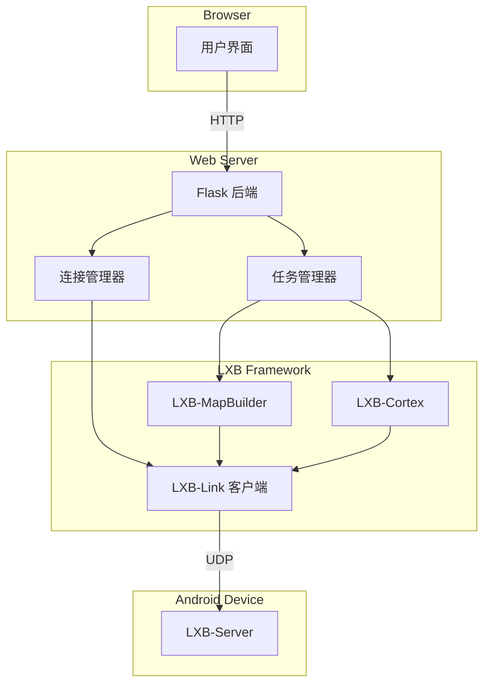
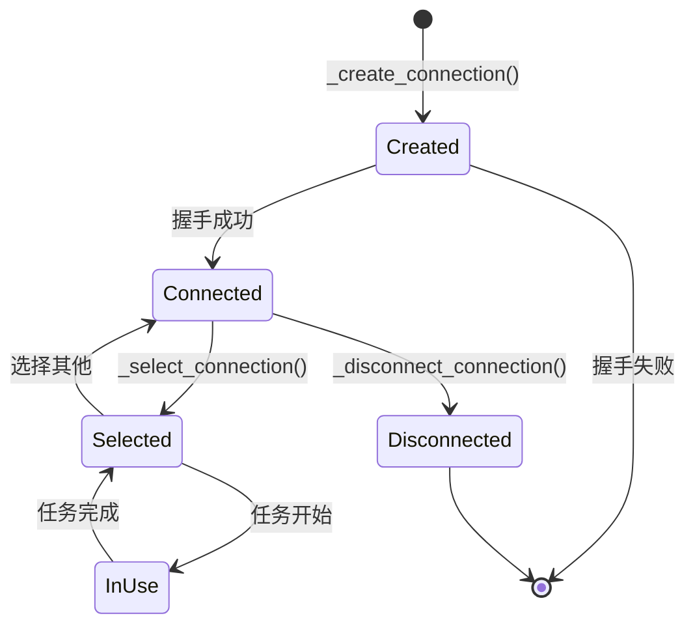
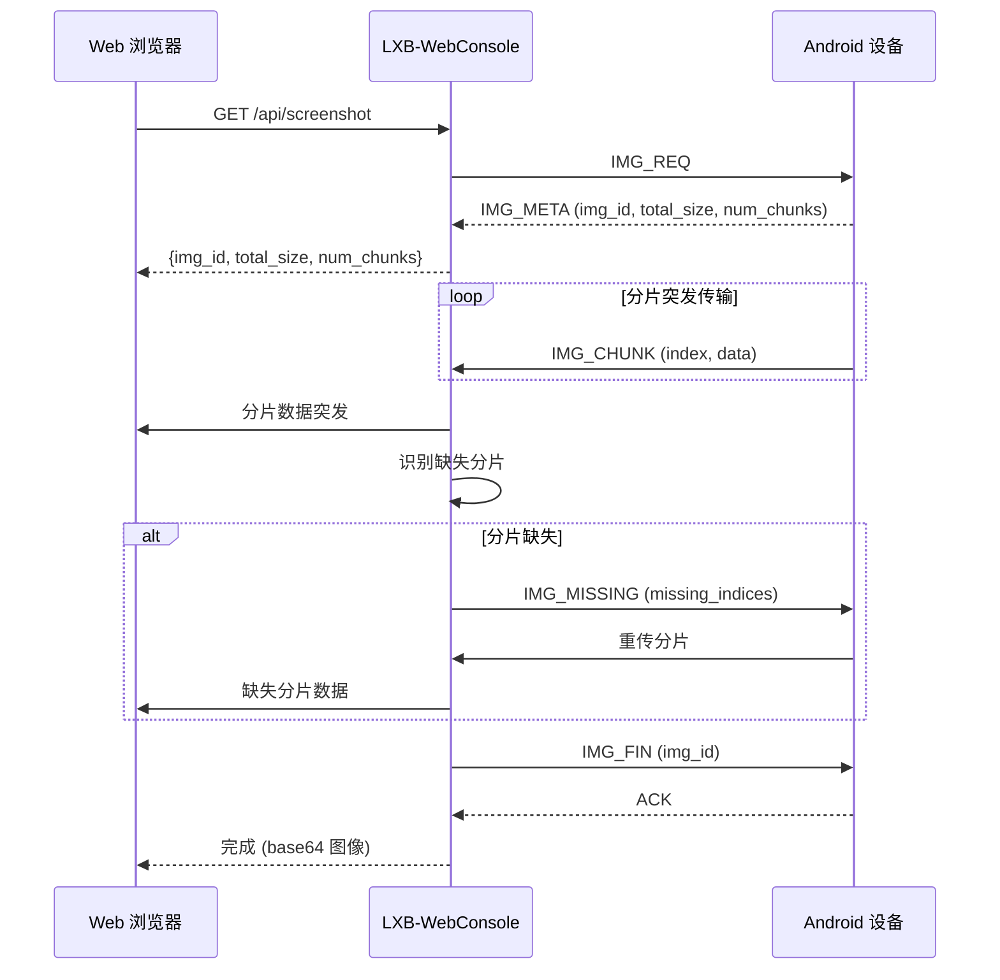

# LXB-WebConsole: 设备管理统一 Web 界面

## 1. 范围与概述

LXB-WebConsole 是统一的 Web 入口，为连接管理、命令调试、地图构建、地图查看和 Cortex 自动化执行提供接口。基于 Flask 后端和 JavaScript 前端构建，通过 HTTP API 实现实时设备交互，并采用设备级锁定机制确保并发操作安全。

**学术贡献**: LXB-WebConsole 展示了一种**基于 Web 的自动化编排**架构，支持带实时反馈的远程设备控制，实现了设备级锁定机制，可防止多线程自动化任务期间的命令冲突。

## 2. 架构概览

### 2.1 代码组织

```
web_console/
├── app.py                      # Flask 后端服务
├── templates/                  # HTML 模板
│   ├── index.html              # 连接状态页
│   ├── command_studio.html     # 命令调试界面
│   ├── map_builder.html        # 自动地图构建界面
│   ├── map_viewer.html         # 地图可视化和编辑
│   └── cortex_route.html       # 路由执行器界面
└── static/
    └── js/
        └── main.js              # 前端交互逻辑
```

### 2.2 系统架构



### 2.3 模块关系

```
┌─────────────────────────────────────────────────────────────┐
│ Web Browser (用户界面)                                       │
│                                                              │
│  ┌──────────┐  ┌──────────────┐  ┌──────────┐  ┌────────┐ │
│  │ 连接     │  │ 命令         │  │ 地图     │  │ Cortex │ │
│  │ 设备     │  │ 调试器       │  │ 构建器   │  │ 路由   │ │
│  └────┬─────┘  └──────┬───────┘  └────┬─────┘  └───┬────┘ │
└───────┼───────────────┼───────────────┼────────────┼───────┘
        │               │               │            │
        ▼               ▼               ▼            ▼
┌─────────────────────────────────────────────────────────────┐
│ Flask Backend (app.py)                                       │
│                                                              │
│  ┌─────────────┐  ┌─────────────┐  ┌─────────────────┐    │
│  │ 连接        │  │ 任务        │  │ 配置            │    │
│  │ 管理器      │  │ 管理器      │  │ 管理器          │    │
│  └──────┬──────┘  └──────┬──────┘  └────────┬────────┘    │
└─────────┼─────────────────┼──────────────────┼──────────────┘
          │                 │                  │
          ▼                 ▼                  ▼
┌─────────────────────────────────────────────────────────────┐
│ LXB Framework Modules                                       │
│  ┌──────────┐  ┌──────────────┐  ┌──────────┐              │
│  │ LXB-Link │  │ LXB-MapBuilder│  │LXC-Cortex│              │
│  └────┬─────┘  └──────┬───────┘  └────┬─────┘              │
└───────┼─────────────────┼──────────────────┼───────────────┘
        │                 │                  │
        ▼                 ▼                  ▼
┌─────────────────────────────────────────────────────────────┐
│ Android Device (LXB-Server)                                  │
└─────────────────────────────────────────────────────────────┘
```

## 3. 连接管理

### 3.1 多设备连接架构

**连接记录结构**:

```python
@dataclass
class ConnectionRecord:
    connection_id: str           # 唯一 UUID
    host: str                    # 设备 IP 地址
    port: int                    # UDP 端口
    source: str                  # 'manual' 或 'auto'
    client: LXBLinkClient        # LXB-Link 客户端实例
    created_at: str              # ISO 时间戳
    last_seen: str               # 最后活动时间戳
    status: str                  # 'connected', 'disconnected'
    running_tasks: int           # 活动任务计数
    lock: threading.RLock        # 设备级锁定
```

**全局状态**:

```python
CONNECTIONS: Dict[str, ConnectionRecord] = {}  # 所有连接
CONNECTIONS_LOCK = threading.RLock()            # 保护 CONNECTIONS
CURRENT_CONNECTION_ID: Optional[str] = None     # 活动连接
```

### 3.2 连接生命周期



### 3.3 设备级锁定

**目的**: 当多个操作针对同一设备时，防止命令冲突

**实现**:

```python
def execute_on_device(connection_id: str, operation: Callable):
    """
    使用设备级锁定执行操作。

    确保同一时间只有一个操作可以在设备上执行。
    """
    record = _get_connection(connection_id)

    with record.lock:  # 获取设备锁定
        record.running_tasks += 1
        try:
            result = operation(record.client)
            return result
        finally:
            record.running_tasks -= 1
```

**锁定属性**:
- **可重入**: 同一线程可以多次获取
- **独占**: 同一时间只有一个线程持有锁定
- **每设备独立**: 每个设备都有独立的锁定

## 4. 屏幕镜像

### 4.1 分片传输协议

**协议**: 基于 HTTP 的分片传输（非 MJPEG，非 WebSocket）

**采用此方案的原因**:
- HTTP 兼容性 - 无需额外的协议协商
- 分片传输可处理大图像（避免 2MB 限制）
- 选择性重传提高可靠性
- 可通过 HTTP 代理工作

### 4.2 传输流程



### 4.3 API 端点

```python
@app.route('/api/screenshot', methods=['GET'])
def get_screenshot():
    """
    通过分片传输获取当前截图。

    返回:
        JSON 包含:
        - success: boolean
        - image: base64 编码的 JPEG
        - width: 图像宽度
        - height: 图像高度
        - size: 图像大小（字节）
    """
    record = _get_connection()
    with record.lock:
        image_data = record.client.request_screenshot_fragmented()

    # 编码为 base64 以便 JSON 传输
    image_b64 = base64.b64encode(image_data).decode('utf-8')

    return jsonify({
        'success': True,
        'image': image_b64,
        'size': len(image_data)
    })
```

### 4.4 性能特征

| 指标 | 值 | 说明 |
|--------|-------|-------|
| 分片大小 | 32KB | 平衡效率与丢包影响 |
| 典型分片数 | 30-60 | 对于 1080×2400 JPEG，质量 85 |
| 传输时间 | 200-500ms | 局域网条件 |
| 帧率 | 2-5 FPS | 500ms 间隔轮询 |
| 带宽 | 500KB-2MB | 每帧（取决于内容）|

## 5. 命令执行

### 5.1 命令调试器 API

**端点**: `POST /api/command/execute`

**请求格式**:

```json
{
  "command": "tap",
  "params": {
    "x": 500,
    "y": 800
  },
  "connection_id": "optional-uuid"
}
```

**支持的命令**:
- `tap`: 在 (x, y) 处单击
- `swipe`: 从 (x1, y1) 滑动到 (x2, y2)，带持续时间
- `input_text`: 输入文本字符串
- `key_event`: 发送按键事件（HOME、BACK、ENTER）
- `get_activity`: 获取当前活动
- `dump_actions`: 导出交互节点

### 5.2 带锁定的执行流程

```python
@app.route('/api/command/execute', methods=['POST'])
def execute_command():
    """
    使用设备级锁定在连接的设备上执行命令。

    确保当多个请求同时针对同一设备时，
    命令执行的线程安全性。
    """
    data = request.get_json()
    command = data.get('command')
    params = data.get('params', {})
    connection_id = data.get('connection_id')

    record = _get_connection(connection_id)

    def execute(client):
        if command == 'tap':
            return client.tap(params['x'], params['y'])
        elif command == 'swipe':
            return client.swipe(
                params['x1'], params['y1'],
                params['x2'], params['y2'],
                params.get('duration', 300)
            )
        # ... 其他命令

    # 使用设备锁定执行
    with record.lock:
        result = execute(record.client)
        record.last_seen = _now_iso()

    return jsonify({'success': True, 'result': result})
```

## 6. 地图构建界面

### 6.1 地图构建器 API

**开始探索**:

```python
@app.route('/api/explore/start', methods=['POST'])
def start_exploration():
    """
    开始自动地图构建。

    返回:
        JSON 包含用于进度跟踪的 task_id
    """
    data = request.get_json()
    package_name = data.get('package_name')
    config = data.get('config', {})

    record = _get_connection()

    task_id = _task_create('explore', record.connection_id)

    def explore_task():
        with record.lock:
            from src.auto_map_builder.node_explorer import NodeMapBuilder

            builder = NodeMapBuilder(
                client=record.client,
                vlm_engine=_get_vlm_engine(),
                config=config
            )

            nav_map = builder.explore(package_name)

            # 保存地图到文件
            map_path = f"maps/{package_name}.json"
            save_map(nav_map, map_path)

            _task_finish(task_id, success=True, result={
                'map_path': map_path,
                'pages': len(nav_map.pages),
                'transitions': len(nav_map.transitions)
            })

    # 在后台线程中运行
    threading.Thread(target=explore_task, daemon=True).start()

    return jsonify({'success': True, 'task_id': task_id})
```

**进度轮询**:

```python
@app.route('/api/explore/progress/<task_id>', methods=['GET'])
def get_explore_progress(task_id):
    """
    获取探索进度。

    返回:
        JSON 包含当前进度、截图和发现的节点
    """
    with TASKS_LOCK:
        task = TASKS.get(task_id)

    return jsonify({
        'status': task['status'],
        'events': task['events'][-10:],  # 最后 10 个事件
        'done': task['done'],
        'success': task.get('success', False)
    })
```

### 6.2 实时更新

**轮询方式**: 前端每 500ms 轮询进度端点

```javascript
// 前端轮询
const pollInterval = setInterval(async () => {
    const response = await fetch(`/api/explore/progress/${taskId}`);
    const data = await response.json();

    updateProgress(data);

    if (data.done) {
        clearInterval(pollInterval);
    }
}, 500);
```

**未来增强**: 使用 WebSocket 实现服务器推送更新

## 7. Cortex 路由执行

### 7.1 路由执行 API

**提交任务**:

```python
@app.route('/api/cortex/submit', methods=['POST'])
def submit_cortex_task():
    """
    提交 Route-Then-Act 自动化任务。

    返回:
        JSON 包含用于跟踪的 task_id
    """
    data = request.get_json()
    user_task = data.get('user_task')
    map_path = data.get('map_path')
    connection_id = data.get('connection_id')

    record = _get_connection(connection_id)

    task_id = _task_create('cortex', record.connection_id, user_task)

    def cortex_task():
        with record.lock:
            from src.cortex.fsm_runtime import CortexFSMEngine

            engine = CortexFSMEngine(
                client=record.client,
                llm_planner=_get_llm_planner()
            )

            result = engine.run(
                user_task=user_task,
                map_path=map_path
            )

            _task_finish(
                task_id,
                success=result['status'] == 'success',
                result=result
            )

    threading.Thread(target=cortex_task, daemon=True).start()

    return jsonify({'success': True, 'task_id': task_id})
```

### 7.2 状态跟踪

**任务状态**:
- `created`: 任务已排队
- `running`: 任务正在执行
- `done`: 任务已完成
- `failed`: 任务失败

**事件类型**:
- `state_change`: FSM 状态转换
- `route_step`: 导航步骤已执行
- `vision_turn`: VLM 动作已执行
- `error`: 发生错误
- `complete`: 任务完成

## 8. 配置管理

### 8.1 Cortex LLM 配置

**配置文件**: `.cortex_llm_planner.json`

**默认配置**:

```python
_default_cortex_llm_config() = {
    # LLM API 设置
    'api_base_url': os.getenv('CORTEX_LLM_API_BASE_URL', ''),
    'api_key': os.getenv('CORTEX_LLM_API_KEY', ''),
    'model_name': os.getenv('CORTEX_LLM_MODEL_NAME', 'qwen-plus'),
    'temperature': float(os.getenv('CORTEX_LLM_TEMPERATURE', '0.1')),
    'timeout': int(os.getenv('CORTEX_LLM_TIMEOUT', '30')),

    # VLM 设置
    'vision_jpeg_quality': int(os.getenv('CORTEX_VISION_JPEG_QUALITY', '35')),

    # 路由/FSM 设置
    'map_filepath': '',
    'package_name': '',
    'reconnect_before_run': True,
    'use_llm_planner': True,
    'route_recovery_enabled': False,
    'max_route_restarts': 0,
    'use_vlm_takeover': False,

    # FSM 运行时
    'fsm_max_turns': 40,
    'fsm_max_vision_turns': 20,
    'fsm_action_interval_sec': 0.8,
    'fsm_tap_jitter_sigma_px': 2.0,
    'fswipe_jitter_sigma_px': 4.0,
    'fsm_xml_stable_samples': 4,
    'fsm_xml_stable_timeout_sec': 4.0,
}
```

**API 端点**:

```python
@app.route('/api/config/cortex', methods=['GET'])
def get_cortex_config():
    """获取当前 Cortex LLM 配置。"""
    return jsonify(_load_cortex_llm_config())

@app.route('/api/config/cortex', methods=['POST'])
def save_cortex_config():
    """保存 Cortex LLM 配置。"""
    config = request.get_json()
    _save_cortex_llm_config(config)
    return jsonify({'success': True})
```

## 9. 并发模型

### 9.1 线程架构

**主线程**: Flask 请求处理

**后台线程**: 任务执行（探索、cortex）

**线程安全性**:
- `CONNECTIONS_LOCK`: 保护连接字典
- `TASKS_LOCK`: 保护任务字典
- `record.lock`: 每设备可重入锁定

### 9.2 锁定顺序

**死锁预防**: 始终按一致顺序获取锁定

```
1. CONNECTIONS_LOCK (如果访问 CONNECTIONS)
2. record.lock (如果访问设备)
```

**禁止**:
```
1. record.lock
2. CONNECTIONS_LOCK  # 可能死锁!
```

### 9.3 任务线程

**任务执行模式**:

```python
def run_task_async(task_func, task_id):
    """在后台线程中运行任务，使用适当的锁定。"""

    def wrapper():
        try:
            result = task_func()
            _task_finish(task_id, True, result=result)
        except Exception as e:
            _task_finish(task_id, False, message=str(e))

    thread = threading.Thread(target=wrapper, daemon=True)
    thread.start()

    return task_id
```

**守护线程**: 后台线程标记为守护线程以允许干净关闭

## 10. 错误处理

### 10.1 错误响应格式

```json
{
  "success": false,
  "message": "错误描述",
  "code": "ERROR_CODE",
  "details": {}
}
```

### 10.2 常见错误代码

| 代码 | 描述 |
|------|-------------|
| `device_not_connected` | 无活动设备连接 |
| `device_not_found` | 未找到指定的 connection_id |
| `command_failed` | 设备上命令执行失败 |
| `task_not_found` | 未找到任务 ID |
| `invalid_config` | 无效的配置参数 |

### 10.3 异常处理

```python
@app.route('/api/command/execute', methods=['POST'])
def execute_command():
    try:
        record = _get_connection()  # 可能抛出 RuntimeError

        with record.lock:
            result = execute_command(record.client, data)

        return jsonify({'success': True, 'result': result})

    except RuntimeError as e:
        return jsonify({'success': False, 'message': str(e)}), 400
    except Exception as e:
        logger.error(f"命令执行失败: {e}")
        return jsonify({'success': False, 'message': '内部错误'}), 500
```

## 11. 前端架构

### 11.1 UI 页面

| 页面 | 路由 | 功能 |
|------|-------|----------|
| 状态仪表板 | `/` | 连接列表、设备信息 |
| 命令调试器 | `/command_studio` | 发送命令、查看结果 |
| 地图构建器 | `/map_builder` | 自动地图构建、进度 |
| 地图查看器 | `/map_viewer` | 地图可视化、编辑 |
| Cortex 路由 | `/cortex_route` | 任务提交、监控 |

### 11.2 JavaScript 模块

**主要模块**:
- `connection.js`: 设备连接管理
- `command.js`: 命令执行和结果显示
- `screenshot.js`: 带轮询的屏幕镜像
- `mapBuilder.js`: 地图构建进度跟踪
- `cortex.js`: 任务提交和状态监控

## 12. 交叉引用

- `docs/zh/lxb_link.md` - 设备通信协议
- `docs/zh/lxb_map_builder.md` - 地图构建集成
- `docs/zh/lxb_cortex.md` - 自动化执行

## 13. 学术贡献总结

从研究角度来看，LXB-WebConsole 展示了以下创新贡献:

1. **基于 Web 的自动化编排**: 基于 HTTP 的架构，用于远程设备控制，无需本地客户端应用即可实现跨平台自动化。

2. **设备级锁定机制**: 每设备可重入锁定，防止并发多线程自动化任务期间的命令冲突。

3. **分片截图传输**: 基于 HTTP 的分片图像传输协议，在局域网上实现 2-5 FPS 屏幕镜像，无需专门协议。

4. **多设备连接管理**: 统一连接模型，支持同时管理多个 Android 设备，具有隔离的执行上下文。

5. **实时进度流**: 基于轮询的长时间运行任务（地图构建、自动化）进度更新，带有结构化事件日志。

6. **配置持久化**: 基于 JSON 的 LLM 参数和运行时设置配置管理，支持运行时重新加载。

---

**文档版本**: 2.0-dev
**最后更新**: 2026-02-26
**后端**: Flask (Python 3.9+)
**前端**: Vanilla JavaScript (ES6+)
